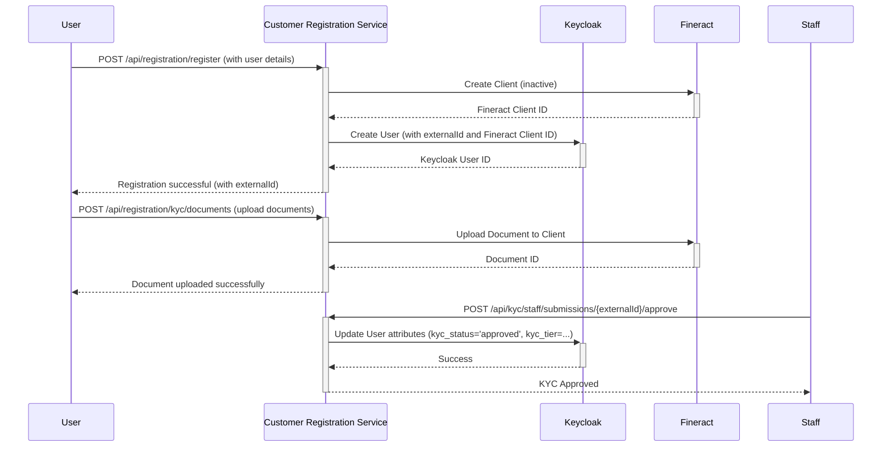

# Customer Registration API Testing Guide (with curl)

This document provides `curl` commands to test the entire Customer Registration Service API flow.

---

## Architecture Overview

The following diagram illustrates the registration and KYC flow, showing the interactions between the user, the customer registration service, Keycloak, and Fineract.



## Prerequisites: Keycloak Configuration for Local Testing

Before you begin testing, you must perform a one-time configuration in your local Keycloak instance to ensure the registration service can function correctly.

### 1. Make the `externalId` Searchable

The registration service needs to be able to find users by their `externalId`. You must tell Keycloak to make this attribute searchable.

1.  Log in to the **Keycloak Admin Console** and select the `fineract` realm.
2.  Go to **"Realm Settings"** -> **"User Profile"**.
3.  Click on **"Create attribute"**.
4.  Set the **"Name"** to `fineract_external_id`.
5.  In the "Permission" section, turn on the **"Searchable"** toggle for the `admin` role.
6.  Click **"Save"**.

### 2. Configure the `mifos` Service Account

The registration service uses a service account (username: `mifos`) to communicate with Fineract. You must ensure this account is active and has no pending required actions.

1.  In the Keycloak Admin Console, go to **"Users"** and find the `mifos` user.
2.  Go to the **"Details"** tab.
3.  Ensure there are no **"Required Actions"** listed. If there are (e.g., "Update Password"), clear them and save the user.

### 3. Create and Configure the `self-service-customer` Role and Group

The service requires users to have the `self-service-customer` role to access the account endpoints. This role is typically assigned to a group, and users are added to that group.

#### a. Create the `self-service-customer` Role

1.  In the Keycloak Admin Console, go to **"Realm Roles"** and click **"Create role"**.
2.  Set the **"Role name"** to `self-service-customer`.
3.  Click **"Save"**.

#### b. Create the `self-service-customers` Group

1.  Go to **"Groups"** and click **"Create group"**.
2.  Set the **"Name"** to `self-service-customers`.
3.  Click **"Save"**.

#### c. Assign the Role to the Group

1.  Click on the `self-service-customers` group you just created.
2.  Go to the **"Role Mappings"** tab.
3.  Click **"Assign role"**.
4.  Select the `self-service-customer` role and click **"Assign"**.

### 4. Clear Required Actions for the Registered User

When a new customer is registered via the API, Keycloak assigns "Required Actions" to that user, such as verifying their email. For API testing, you must manually clear these actions to be able to obtain a token.

1.  In the Keycloak Admin Console, go to **"Users"** and find the user you registered (e.g., `johndoe1@example.com`).
2.  Go to the **"Details"** tab.
3.  Ensure there are no **"Required Actions"** listed. If there are, clear them and save the user.

### 5. Configure Keycloak Mappers to Add Custom Claims to JWT

The registration service relies on custom claims within the JWT to identify the user. You must configure Keycloak to add the user's `fineract_external_id` and `fineract_client_id` attributes to the access token.

**Note:** These instructions are for Keycloak 26. The navigation may differ slightly in other versions.

1.  In the Keycloak Admin Console, go to **"Client Scopes"** in the left-hand menu.
2.  Click on the client scope dedicated to your client, which is likely named `setup-app-client-dedicated`.
3.  Go to the **"Mappers"** tab.
4.  Click **"Add mapper"** and select **"By configuration"**.
5.  From the list of mapper types, select **"User Attribute"**.
6.  Configure the mapper for `fineract_external_id`:
    *   **Name:** `fineract_external_id` (or something descriptive)
    *   **User Attribute:** `fineract_external_id` (this must exactly match the attribute name on the user's profile)
    *   **Token Claim Name:** `fineract_external_id` (this is the name that will appear in the JWT)
    *   **Claim JSON Type:** `String`
    *   **Add to access token:** Make sure this is toggled **ON**.
7.  Click **"Save"**.
8.  Repeat steps 4-7 to create another mapper for `fineract_client_id`.

---

## Step 1: Register a New Customer and Store the externalId

This command will register a new user and then automatically extract the `externalId` from the JSON response and store it in a shell variable called `EXTERNAL_ID`.

### Command

```bash
EXTERNAL_ID=$(curl -s --location --request POST "http://localhost:8081/api/registration/register" \
--header "Content-Type: application/json" \
--data '{
    "firstName": "John1",
    "lastName": "Doe1",
    "email": "johndoe1@example.com",
    "phone": "+12345678903",
    "dateOfBirth": "1990-01-15",
    "nationalId": "123456789",
    "address": {
        "street": "123 Main St",
        "city": "Anytown",
        "postalCode": "12345",
        "country": "USA"
    }
}' | jq -r '.externalId')
```

You can check that the ID is stored by running `echo $EXTERNAL_ID`.

---

## Step 2: Get an Authentication Token

The other endpoints are protected. You need an authentication token from Keycloak to call them.

### Command to Get and Store the Token

The following command will get the token and save it to a shell variable named `TOKEN`. This avoids having to copy and paste it. This command requires you to have `jq` installed (`sudo apt-get install jq`).

Replace the username, password, and client secret with your values.

```bash
TOKEN=$(curl -s --location --request POST "http://localhost:9000/realms/fineract/protocol/openid-connect/token" \
--header "Content-Type: application/x-www-form-urlencoded" \
--data-urlencode "client_id=setup-app-client" \
--data-urlencode "client_secret=**********" \
--data-urlencode "username=johndoe1@example.com" \
--data-urlencode "password=password" \
--data-urlencode "grant_type=password" | jq -r '.access_token')
```

You can check that the token is stored by running `echo $TOKEN`.

---

## Step 3: Test the Protected Endpoints

Now you can use the `$TOKEN` and `$EXTERNAL_ID` shell variables in your requests.

### Get Registration Status

**Command:**

```bash
curl --location --request GET "http://localhost:8081/api/registration/status/$EXTERNAL_ID" \
--header "Authorization: Bearer $TOKEN"
```

### Get KYC Status

**Command:**

```bash
curl --location --request GET "http://localhost:8081/api/registration/kyc/status" \
--header "X-External-Id: $EXTERNAL_ID" \
--header "Authorization: Bearer $TOKEN"
```

### Get Transaction Limits

**Command:**

```bash
curl --location --request GET "http://localhost:8081/api/registration/limits" \
--header "X-External-Id: $EXTERNAL_ID" \
--header "Authorization: Bearer $TOKEN"
```

### Upload KYC Document

**Command:**
Update the path to your document (`@/path/to/your/id_front.jpg`).

```bash
curl --location --request POST "http://localhost:8081/api/registration/kyc/documents" \
--header "Authorization: Bearer $TOKEN" \
--header "X-External-Id: $EXTERNAL_ID" \
--form "documentType=id_front" \
--form "file=@/path/to/your/id_front.jpg"
```

---

## Step 4: Test the Account Endpoints

These endpoints allow you to view account information.

**Prerequisite:** The customer's Fineract client must be active (KYC approved) and have at least one savings account. A savings account is **not** created automatically during registration. You must create one manually in Fineract after the client has been activated.

### Get All Savings Accounts

**Command:**

```bash
curl --location --request GET "http://localhost:8081/api/accounts/savings" \
--header "Authorization: Bearer $TOKEN"
```

The response will be a JSON object containing a list of accounts. You can use `jq` to extract the `id` of the first account and store it in a shell variable called `ACCOUNT_ID`.

```bash
ACCOUNT_ID=$(curl -s --location --request GET "http://localhost:8081/api/accounts/savings" \
--header "Authorization: Bearer $TOKEN" | jq -r '.accounts[0].id')
```

You can check that the ID is stored by running `echo $ACCOUNT_ID`.

### Get a Specific Savings Account

**Command:**
This command uses the `$ACCOUNT_ID` shell variable obtained in the previous step.

```bash
curl --location --request GET "http://localhost:8081/api/accounts/savings/$ACCOUNT_ID" \
--header "Authorization: Bearer $TOKEN"
```

### Get Account Transactions

**Command:**
This command uses the `$ACCOUNT_ID` shell variable.

```bash
curl --location --request GET "http://localhost:8081/api/accounts/savings/$ACCOUNT_ID/transactions" \
--header "Authorization: Bearer $TOKEN"
```

---

## Step 5: Test the KYC Review Endpoints

These endpoints are for staff members to review KYC submissions.

**Prerequisite:** You must have a staff user with the `kyc-reviewer` or `admin` role in Keycloak. The customer registration service uses a service account (the `mifos` user) to communicate with Fineract. Therefore, the staff user only needs to exist in Keycloak with the appropriate roles.

### How to get a staff token

1.  **Create a staff user in Keycloak:**
    *   Log in to the **Keycloak Admin Console** and select the `fineract` realm.
    *   Go to **"Users"** and click on **"Add user"**.
    *   Fill in the user details and click **"Save"**.
    *   Go to the **"Credentials"** tab and set a password for the user.

2.  **Assign the required role to the user:**
    *   Go to the **"Role Mappings"** tab for the user.
    *   Assign the `kyc-reviewer` or `admin` realm role to the user.

3.  **Get the token:**
    *   Use the same `curl` command as in "Step 2: Get an Authentication Token", but with the staff user's credentials.

The prerequisite for these roles is defined in the `KycReviewController.java` file with the annotation `@PreAuthorize("hasAnyRole('kyc-reviewer', 'admin')")`.

**Note:** The following commands assume you have a staff token stored in a shell variable called `STAFF_TOKEN`.

### Get KYC Statistics

**Command:**

```bash
curl --location --request GET "http://localhost:8081/api/kyc/staff/stats" \
--header "Authorization: Bearer $STAFF_TOKEN"
```

### Get KYC Submissions

**Command:**

```bash
curl --location --request GET "http://localhost:8081/api/kyc/staff/submissions" \
--header "Authorization: Bearer $STAFF_TOKEN"
```

### Get a Single KYC Submission

**Command:**
Replace `{externalId}` with the customer's external ID.

```bash
curl --location --request GET "http://localhost:8081/api/kyc/staff/submissions/{externalId}" \
--header "Authorization: Bearer $STAFF_TOKEN"
```

### Approve a KYC Submission

**Command:**
Replace `{externalId}` with the customer's external ID.

```bash
curl --location --request POST "http://localhost:8081/api/kyc/staff/submissions/{externalId}/approve" \
--header "Content-Type: application/json" \
--header "Authorization: Bearer $STAFF_TOKEN" \
--data '{
    "newTier": 1,
    "notes": "KYC documents are clear and valid."
}'
```

### Reject a KYC Submission

**Command:**
Replace `{externalId}` with the customer's external ID.

```bash
curl --location --request POST "http://localhost:8081/api/kyc/staff/submissions/{externalId}/reject" \
--header "Content-Type: application/json" \
--header "Authorization: Bearer $STAFF_TOKEN" \
--data '{
    "reason": "Invalid document"
}'
```

### Request More Information

**Command:**
Replace `{externalId}` with the customer's external ID.

```bash
curl --location --request POST "http://localhost:8081/api/kyc/staff/submissions/{externalId}/request-info" \
--header "Content-Type: application/json" \
--header "Authorization: Bearer $STAFF_TOKEN" \
--data '{
    "comment": "Please upload a clearer picture of your ID."
}'
```

---

## Understanding `externalId` and `accountId`

*   **`externalId`**: This is a unique identifier (UUID) generated by the customer registration service when a new customer is registered. It is used to identify the customer across the entire system, including in Keycloak and Fineract.

*   **`accountId`**: This is the identifier for a specific savings account in Fineract. A customer can have multiple accounts, and each will have a unique `accountId`.
