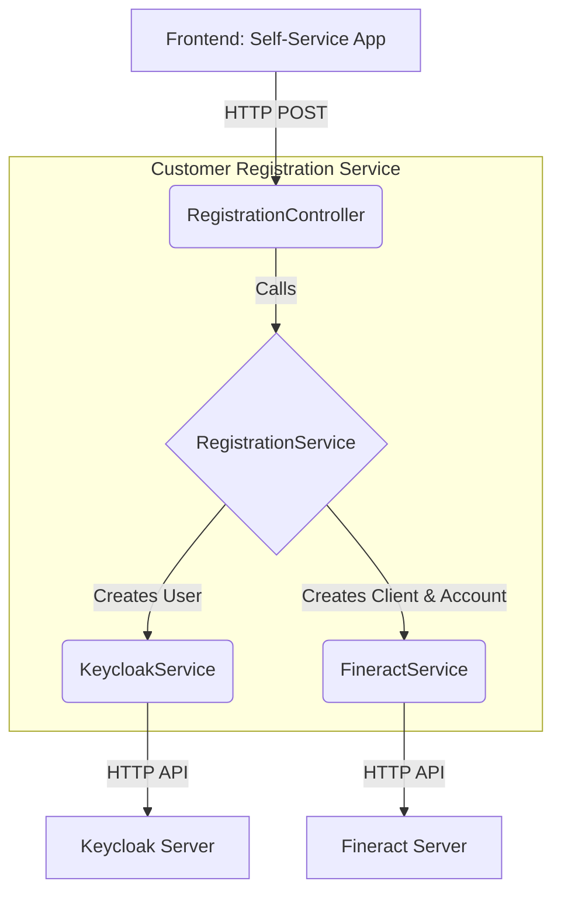
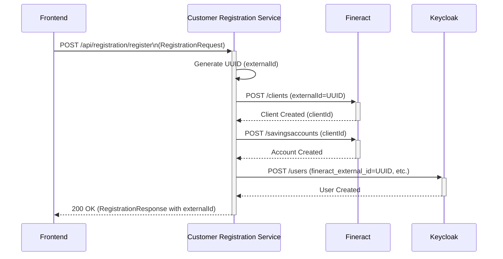

# Customer Registration Service Architecture

This document provides a detailed overview of the architecture, components, and data flow of the Customer Registration Service.

## 1. Overview

The Customer Registration Service is a Spring Boot application that orchestrates the customer self-registration process. It acts as a middleware between the `self-service-app` frontend, the Fineract core banking platform, and the Keycloak identity and access management server.

Its primary responsibilities are:
- Creating a new client in Fineract.
- Creating a default savings account for the new client in Fineract.
- Creating a corresponding user in Keycloak.
- Linking the Keycloak user to the Fineract client using a unique external ID.
- Triggering the necessary Keycloak actions for the user, such as email verification and WebAuthn registration.

## 2. Technology Stack

- **Java Version**: 21
- **Framework**: Spring Boot 3.2
- **Build Tool**: Maven
- **Authentication**: Keycloak (via `keycloak-admin-client`)
- **API Documentation**: SpringDoc (OpenAPI/Swagger)
- **Observability**: Micrometer with OpenTelemetry (OTLP)
- **Rate Limiting**: Bucket4j

## 3. Architecture and Components

The service follows a standard layered architecture for a Spring Boot application.



### Components

-   **`RegistrationApplication.java`**: The main entry point for the Spring Boot application.
-   **`controller`**: Contains the REST API endpoints.
    -   `RegistrationController.java`: Exposes the public API for initiating and checking the status of a customer registration.
    -   `KycDocumentController.java`: Handles KYC document uploads.
    -   `KycReviewController.java`: Provides endpoints for KYC review operations.
    -   `HealthController.java`: Provides health check endpoints for monitoring.
-   **`service`**: Contains the core business logic.
    -   `RegistrationService.java`: Orchestrates the entire registration flow, calling the Fineract and Keycloak services. It also includes rollback logic to undo partial registrations if a step fails.
    -   `FineractService.java`: A client service responsible for all communication with the Fineract API (creating clients, savings accounts, etc.).
    -   `KeycloakService.java`: A client service for interacting with the Keycloak Admin API to create users, assign roles/groups, and set required actions.
    -   `KycDocumentService.java`: Manages the logic for uploading and handling KYC documents.
    -   `KycReviewService.java`: Contains logic related to the KYC review process.
    -   `LimitsService.java`: Provides information about transaction limits based on KYC tiers.
-   **`dto` (Data Transfer Objects)**: Plain Java objects used to transfer data between the controller and service layers, and for API request/response bodies. Examples include `RegistrationRequest`, `RegistrationResponse`, `KycDocumentDto`, etc.
-   **`config`**: Contains Spring configuration classes.
    -   `SecurityConfig.java`: Configures the application as a stateless OAuth2 resource server, validating JWTs issued by Keycloak.
    -   `FineractConfig.java`: Handles configuration for the Fineract client.
    -   `KeycloakConfig.java`: Provides the configured `Keycloak` admin client bean.
    -   `OpenApiConfig.java`: Configures the OpenAPI (Swagger) documentation.
    -   `RateLimitConfig.java`: Implements rate limiting on sensitive endpoints.
-   **`exception`**: Defines custom exceptions and a global exception handler to ensure consistent error responses.
-   **`metrics`**:
    - `RegistrationMetrics.java`: Provides custom metrics for monitoring the registration process.

## 4. Sequence Diagram: Registration Flow

This diagram illustrates the sequence of events during a successful customer registration.



## 5. How to Build and Run

### Prerequisites

-   Java 21
-   Maven 3.9+

### Build

To build the application, run the following Maven command from the `fineract-apps/backend/customer-registration-service` directory:

```bash
./mvnw clean package
```

This will compile the code, run tests, and package the application into a JAR file in the `target/` directory.

### Run

You can run the application using the Spring Boot Maven plugin:

```bash
./mvnw spring-boot:run
```

The application will start on `http://localhost:8080` by default.

**Note:** The service requires several environment variables to be set to connect to Keycloak and Fineract, as detailed in the `README.md`.

## 6. API Documentation

The service uses SpringDoc to generate OpenAPI 3.0 documentation. Once the application is running, you can access the Swagger UI at:

- **Swagger UI**: [http://localhost:8080/swagger-ui.html](http://localhost:8080/swagger-ui.html)

The raw OpenAPI specification is available in JSON format at:

- **OpenAPI Spec**: [http://localhost:8080/api-docs](http://localhost:8080/api-docs)
