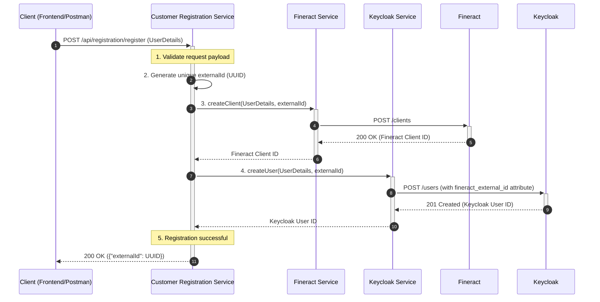
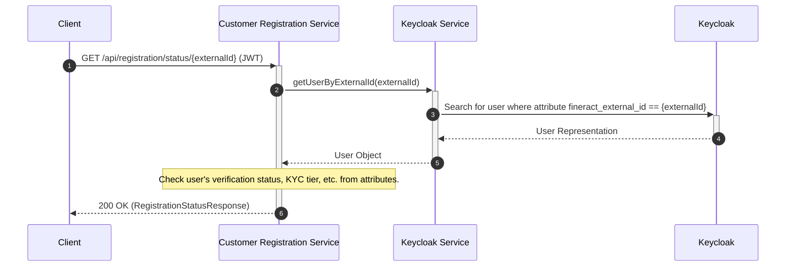

# Customer Registration Service: Architecture Overview

This document provides a high-level overview of the `customer-registration-service` architecture, its components, and their interactions.

## Core Components

The service is built on a microservices architecture pattern and is primarily composed of the following services. Each service has a distinct responsibility, following the Single Responsibility Principle.

*   **Registration Controller (`RegistrationController.java`):** This is the public-facing entry point for all API requests related to registration. It handles HTTP requests, validates the input, and delegates the business logic to the `RegistrationService`.

*   **Registration Service (`RegistrationService.java`):** This is the central orchestrator of the registration process. It manages the entire workflow, including generating the unique `externalId`, calling the Fineract and Keycloak services, and handling rollbacks in case of failure.

*   **Fineract Service (`FineractService.java`):** This service is responsible for all communication with the Fineract core banking system. Its primary role during registration is to create a new "Client" in Fineract, tagging it with the generated `externalId`.

*   **Keycloak Service (`KeycloakService.java`):** This service handles all interactions with Keycloak. It is responsible for creating a new User, assigning the `fineract_external_id` attribute to link the user to the Fineract client, and managing user groups and attributes.

*   **KYC & Limits Services:**
    *   `KycDocumentService.java`: Manages the uploading and processing of KYC documents.
    *   `KycReviewService.java`: Handles the business logic for KYC review, approval, and rejection.
    *   `LimitsService.java`: Determines the user's transaction limits based on their verified KYC tier.

## Registration Flow Diagram

The following Mermaid diagram illustrates the sequence of events during a successful new customer registration.

## Status Check Flow

Once a user is registered, other services can check their status using the `externalId`. This flow relies on the searchable attribute we configured in Keycloak.

