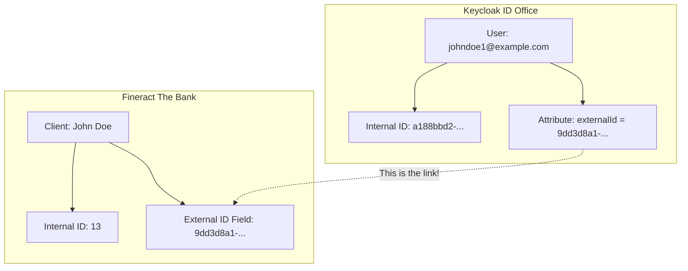

# Core Concepts: Fineract, Keycloak, and IDs

It's completely understandable to be confused. We are dealing with two different systems that need to work together, and it can be tricky. This document explains the core concepts.

## The Two Systems: A Simple Analogy

Think of it like this:

-   **Fineract is the Bank**: It holds your bank accounts, your money, and your transaction history. It knows you as "Client #123".
-   **Keycloak is the ID Card Office**: It is responsible for verifying who you are and giving you an ID card (a login/password). It knows you as "Citizen #ABC".

The bank needs to know that the person with ID card #ABC is the same person as their client #123.

## The Problem: How to Link the Systems?

When you log in to the mobile app, you log in with Keycloak. The app then needs to ask Fineract to show you your bank account. How does the app prove to Fineract who you are?

We need a reliable way to link your Keycloak identity to your Fineract bank client. We can't just use your email, because you might change it one day.

## The Solution: The "External ID"

During registration, we create a special, unique ID called the **`externalId`**. It's just a long, random string of characters.

-   We create a client in **Fineract** (the bank) and tell Fineract that this client's `externalId` is `9dd3d8a1-ef75-40fb-a94e-214ffa186868`.
-   We create a user in **Keycloak** (the ID office) and save the *same* `externalId` (`9dd3d8a1-ef75-40fb-a94e-214ffa186868`) on that user's profile.

This `externalId` is the bridge between the two systems.

## What are "User Attributes"?

Keycloak allows us to store extra, custom pieces of information on a user's profile. Think of it like writing notes on the back of a person's file in the ID office.

This is where we store the `externalId`. We also store other useful information there, like the user's `kyc_status` and `kyc_tier`.

## Why is Registration Status from Keycloak?

The "registration status" that the endpoint checks is about your *login account*, not your bank account. It answers questions like:

-   Has the user verified their email address?
-   Has the user set up their password or security key?

These are all concerns for the **ID Card Office (Keycloak)**. The bank (Fineract) doesn't care if you have verified your email; it only cares that you have been properly identified by Keycloak.

So, when we ask for the "registration status", we are asking Keycloak: "Is this user ready to start logging in and using the system?"

## Why are KYC Status and Limits connected to Keycloak?

This is a great question. It's about making the whole system more secure and efficient. The principle is called **Separation of Concerns**.

-   **Fineract's Concern**: To be the "source of truth" for banking information. This includes storing the actual KYC *documents* (like your ID card scan).
-   **Keycloak's Concern**: To be the "source of truth" for user identity and security. It acts as the gatekeeper for all other services.

### Why KYC Status is in Keycloak

Imagine you log in and want to make a big money transfer. The "Transfer Service" needs to know if you are a fully verified customer.

-   **The Slow Way**: The Transfer Service could connect to Fineract, search for your client record, check all your uploaded documents, and decide if you are verified. This is slow, and it means the Transfer Service needs to know a lot about Fineract's internal processes.
-   **The Fast Way**: We do the verification once (when the KYC documents are approved). Then, we put a simple "stamp" on your Keycloak user profile. This "stamp" is the `kyc_status: "approved"` attribute.

Now, when you log in, your ID token (JWT) from Keycloak can contain this information. The Transfer Service can just look at the token and immediately see that you are approved. It doesn't need to talk to Fineract at all. It's faster and more secure.

### Why Transaction Limits are checked via Keycloak

The transaction limits a user has (e.g., "can transfer up to $5000 per day") directly depend on their KYC level.

-   Tier 1 (unverified) = low limits
-   Tier 2 (verified) = high limits

Since the KYC level (or "tier") is stored in Keycloak for the security reasons we just discussed, the easiest way to find out a user's limits is to:
1.  Ask Keycloak for the user's `kyc_tier` attribute.
2.  Use that tier to look up the corresponding limits in a configuration table.

So, Keycloak doesn't store the limits themselves, but it stores the *key* that unlocks the limits.
