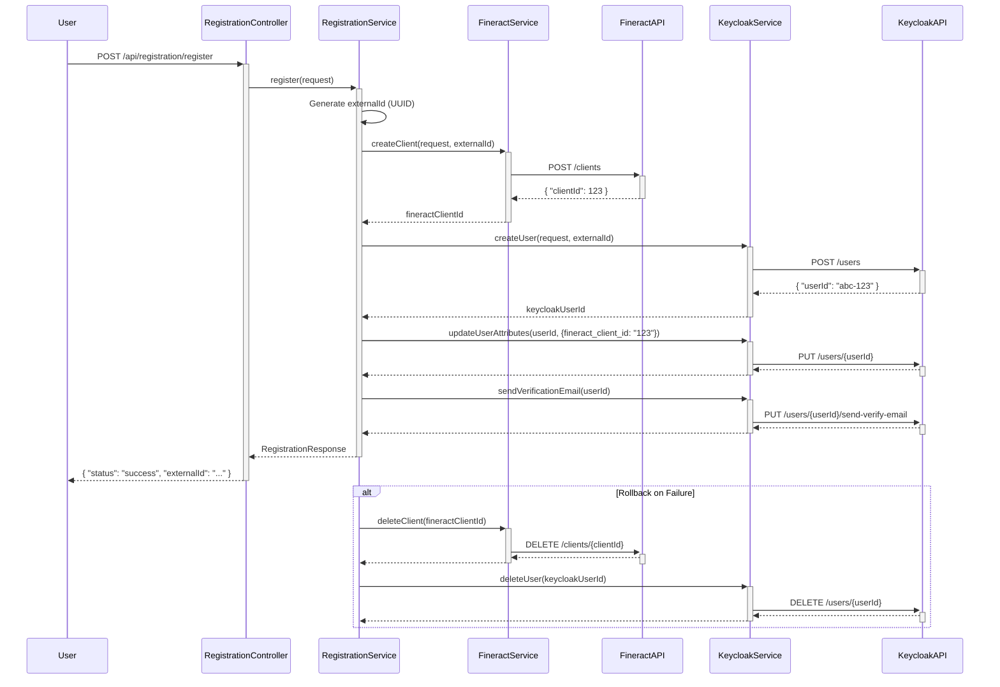

# Customer Registration Flow

This document details the entire customer registration process, including the orchestration between Keycloak and Fineract, ID linking, transactional behavior, and rollback mechanisms.

## Acceptance Criteria Analysis

Based on the analysis, the current implementation meets all the acceptance criteria:

- **A new user is successfully created in Keycloak upon registration:** The `KeycloakService` creates a new user in Keycloak.
- **A new client is successfully created in Fineract with the customer's details:** The `FineractService` creates a new client in Fineract.
- **The Keycloak user ID and Fineract client ID are linked and stored for future reference:** The `externalId` links the two systems, and the `fineract_client_id` is stored in Keycloak for direct reference.
- **The entire orchestration process is transactional, with rollbacks in case of failure in any of the systems:** The `RegistrationService` implements a `rollback` method that deletes the created user and client if any part of the process fails.

## API Endpoint

### `POST /api/registration/register`

This endpoint orchestrates the creation of a user in Keycloak and a corresponding client in Fineract.

#### Request Payload (`RegistrationRequest`)

The table below details the fields for the registration request payload.

| Field | Type | Compulsory | Description |
| :--- | :--- | :--- | :--- |
| `firstName` | String | **Yes** | The customer's first name. |
| `lastName` | String | **Yes** | The customer's last name. |
| `email` | String | **Yes** | The customer's email address. Must be a valid format. |
| `phone` | String | **Yes** | The customer's phone number. Must match `^\\+?[0-9]{9,15}$`. |
| `nationalId` | String | No | The customer's national identification number. |
| `dateOfBirth` | String | No | The customer's date of birth in `YYYY-MM-DD` format. |
| `gender` | String | No | The customer's gender. |
| `address` | Object | No | The customer's address. |
| `address.street`| String | No | Street name and number. |
| `address.city` | String | No | City name. |
| `address.postalCode`| String | No | Postal or ZIP code. |
| `address.country` | String | No | Country name. |

**Example:**
```json
{
  "firstName": "John",
  "lastName": "Doe",
  "email": "john.doe@example.com",
  "phone": "+1234567890",
  "dateOfBirth": "1990-01-01",
  "gender": "MALE",
  "address": {
      "street": "123 Main St",
      "city": "Anytown",
      "postalCode": "12345",
      "country": "USA"
  }
}
```

#### Response Payload (`RegistrationResponse`)

```json
{
  "status": "success",
  "externalId": "a1b2c3d4-e5f6-7890-1234-567890abcdef"
}
```

## Orchestration Logic (`RegistrationService`)

The `RegistrationService` is the central component that orchestrates the entire registration flow. It ensures that the creation of a user in Keycloak and a client in Fineract is a single, atomic transaction.

The process is as follows:

1.  **Generate `externalId`**: A unique UUID is generated to link the Fineract client and the Keycloak user.
2.  **Create Fineract Client**: The `FineractService` is called to create a new client in Fineract.
3.  **Create Keycloak User**: The `KeycloakService` is called to create a new user in Keycloak.
4.  **Link IDs**: The Fineract client ID is stored as an attribute in the Keycloak user's profile.
5.  **Send Verification Email**: A verification email is sent to the user.

## Fineract Integration (`FineractService`)

The `FineractService` is responsible for all interactions with the Fineract API.

### Client Creation

A new client is created in Fineract by mapping fields from the `RegistrationRequest` to the Fineract client API.

| Fineract Field | Source | Notes |
| :--- | :--- | :--- |
| `officeId` | Configuration | Hardcoded value from `fineractConfig.getDefaultOfficeId()`. |
| `firstname` | `RegistrationRequest.firstName` | Direct mapping. |
| `lastname` | `RegistrationRequest.lastName` | Direct mapping. |
| `externalId` | Generated UUID | The unique ID linking to the Keycloak user. |
| `mobileNo` | `RegistrationRequest.phone` | Direct mapping. |
| `emailAddress` | `RegistrationRequest.email` | Direct mapping. |
| `active` | Hardcoded | Always set to `false` initially. The client must be activated later, likely after KYC. |
| `legalFormId` | Hardcoded | Always set to `1` (Person). |
| `locale` | Hardcoded | Always set to `en`. |
| `dateFormat` | Hardcoded | Always set to `dd MMMM yyyy`. |
| `dateOfBirth` | `RegistrationRequest.dateOfBirth` | Sent only if provided in the request. The date is formatted to match `dateFormat`. |
| `genderId` | Configuration | Uses a default value from `fineractConfig.getDefaultGenderId()` if `gender` is provided in the request. No mapping is performed. |

### Address Data Handling

The `address` object, including its nested fields (`street`, `city`, `postalCode`, `country`), is part of the `RegistrationRequest` payload. However, this address data is **not** currently handled by the service. The information is received but is not mapped or sent to either the Fineract client or the Keycloak user, and is therefore not persisted.

## Backend Payload Validation

The service performs validation on the incoming `RegistrationRequest` payload. The following table details the specific validation rules and error messages as defined in the `RegistrationRequest` DTO.

| Field | Validation Annotation | Error Message |
| :--- | :--- | :--- |
| `firstName` | `@NotBlank` | "First name is required" |
| `lastName` | `@NotBlank` | "Last name is required" |
| `email` | `@NotBlank`, `@Email` | "Email is required", "Invalid email format" |
| `phone` | `@NotBlank`, `@Pattern(regexp = "^\\+?[0-9]{9,15}$")` | "Phone number is required", "Invalid phone number format" |

Other fields, including all fields within the nested `address` object, do not have explicit validation annotations applied in the DTO.

### Email Existence Check

In addition to the DTO-level validation, the `KeycloakService` performs a critical check to ensure that the email address is not already registered in Keycloak. If a user with the same email already exists, the registration process is halted, and an `EMAIL_ALREADY_EXISTS` error is returned.

## Keycloak Integration (`KeycloakService`)

The `KeycloakService` handles all interactions with the Keycloak Admin API.

### User Creation

The user representation in Keycloak is built from the `RegistrationRequest` and several default values.

| Keycloak Field | Source | Notes |
| :--- | :--- | :--- |
| `enabled` | Hardcoded | Always `true`. |
| `username` | `RegistrationRequest.email` | The user's email is used as their username. |
| `email` | `RegistrationRequest.email` | Direct mapping. |
| `firstName` | `RegistrationRequest.firstName`| Direct mapping. |
| `lastName` | `RegistrationRequest.lastName` | Direct mapping. |
| `emailVerified`| Hardcoded | Always `false` initially. |
| `attributes` | Mixed | A map of custom attributes is created: |
| `attributes.fineract_external_id`| Generated UUID | The unique ID linking to the Fineract client. |
| `attributes.kyc_tier`| Hardcoded | Initial tier is set to `"1"`. |
| `attributes.kyc_status`| Hardcoded | Initial status is set to `"pending"`. |
| `attributes.phone` | `RegistrationRequest.phone` | Direct mapping. |

### Keycloak User Attributes

During the registration process, the following custom attributes are set for the user in Keycloak:

| Attribute | Source | Initial Value | Description |
| :--- | :--- | :--- | :--- |
| `fineract_external_id`| `RegistrationService` | Generated UUID | The primary link to the Fineract client. This is a stable, unique identifier. |
| `fineract_client_id` | `FineractService` | Fineract's client ID | A performance optimization for direct lookups. This is Fineract's internal primary key for the client. |
| `kyc_tier` | Hardcoded | `"1"` | The initial KYC tier for the user. |
| `kyc_status` | Hardcoded | `"pending"` | The initial KYC status for the user. |
| `phone` | `RegistrationRequest` | User's phone number | The phone number provided during registration. |

### Required Actions

The user is assigned the following required actions:

-   **`VERIFY_EMAIL`**: The user must verify their email address.
-   **`webauthn-register-passwordless`**: The user must set up a passwordless authentication method (e.g., Face ID, Touch ID).

### Group Assignment

The user is automatically added to a group defined in the configuration (`keycloakConfig.getSelfServiceGroup()`), which is typically `self-service-customers`.

## ID Linking Strategy

The connection between a Keycloak user and a Fineract client is established using two distinct identifiers. It is crucial to understand their differences and roles.

### `fineract_external_id` vs. `fineract_client_id`

| Attribute | Value | Origin | Role |
| :--- | :--- | :--- | :--- |
| **`fineract_external_id`** | UUID (e.g., `a1b2c3d4-...`) | Generated by the **Registration Service** | The **primary link** between the two systems. It's a stable, unique identifier stored in both Keycloak user attributes and the Fineract client table. |
| **`fineract_client_id`** | Integer (e.g., `123`) | Generated by the **Fineract Database** | A **performance optimization**. It is Fineract's internal primary key for the client. Storing it in Keycloak allows for direct lookups without needing the UUID. |

They are **not the same value**.

### Acquisition and Storage Flow

The `fineract_client_id` is obtained and stored through a clear, multi-step process orchestrated by the `RegistrationService`.

1.  **Client Creation and ID Extraction:** The `FineractService` sends a `POST` request to Fineract's `/clients` endpoint. Upon successful creation, the Fineract API returns a JSON response containing the new client's internal integer ID, which is the `fineract_client_id`. This value is extracted from the response body.

2.  **Storing as a Keycloak Attribute:** The `RegistrationService` receives the `fineract_client_id` from the `FineractService`. It then immediately calls the `KeycloakService` with the instruction to update the newly created Keycloak user. The `KeycloakService` adds the `fineract_client_id` as a new custom user attribute.

This confirms that the `fineract_client_id` is permanently stored as a **user attribute** in Keycloak's database.

### Attribute vs. JWT Claim

A key distinction must be made between where the ID is stored and how it is transmitted:

-   **Storage:** The `fineract_client_id` is permanently stored as a **User Attribute** within the Keycloak user's profile.
-   **Transmission:** For the ID to be efficiently used in API calls, it must be included in the JWT. This is achieved by configuring a **Mapper** in the Keycloak admin console for the `self-service` client. This mapper takes the value from the `fineract_client_id` user attribute and inserts it as a **claim** into the JWT whenever a user logs in.

### Usage in Authenticated API Calls

The `AccountSecurityService` leverages this architecture to securely and efficiently identify a user's Fineract resources.

-   **Fast Path (Preferred):** The service first attempts to read the `fineract_client_id` claim directly from the JWT. If the claim exists, the service can use the ID to query Fineract for the customer's accounts without any extra lookups.

-   **Fallback Path:** If the `fineract_client_id` claim is not present in the JWT (e.g., due to a misconfiguration in the Keycloak mapper), the service uses the `fineract_external_id` claim as a fallback. It performs a lookup against the Fineract API to find the client with that external ID. The response from this lookup includes the internal `fineract_client_id`, which is then used for subsequent operations. This path is less performant but ensures service resilience.

## Transactional Behavior and Rollback

The registration process is designed to be atomic. If any step fails, the `RegistrationService`'s `rollback` method is triggered. This method deletes the created Keycloak user and Fineract client, ensuring data consistency across both systems.

## Security and Authorization

The service is secured using OAuth2 and JWT tokens issued by Keycloak.

### Public Endpoints
The following endpoints are public and do not require authentication, allowing new users to register and for health checks:
- `POST /api/registration/register`
- `/api/registration/health/**`
- `/actuator/**`
- Swagger/OpenAPI documentation endpoints.

### Protected Endpoints
- `/api/accounts/**`: Requires an authenticated user with the `self-service-customer` role.
- All other endpoints require authentication by default.

### Additional Endpoints

The service exposes the following additional endpoints:

- **`GET /api/registration/status/{externalId}`**: Checks the registration completion status for a customer, including email verification and WebAuthn registration.
- **`GET /api/registration/kyc/status`**: Retrieves the KYC status and document information for a customer. Requires authentication.
- **`GET /api/registration/limits`**: Gets the transaction limits for a customer based on their KYC tier. Requires authentication.

### Role-Based Access Control (RBAC)
- **Roles vs. Groups:** In this service, authorization is based on **roles**. A user is granted the `self-service-customer` role, which gives them access to protected resources like viewing their accounts.
- **Group Assignment:** Upon registration, users are added to the `self-service-customers` **group**. In a typical Keycloak setup, this group is configured to automatically assign the `self-service-customer` role to its members. The service itself does not assign roles directly; it relies on the group-role mapping configured in Keycloak.
- **JWT Token:** When a user logs in, Keycloak includes their assigned roles (e.g., `self-service-customer`) in the `realm_access.roles` claim of the JWT.
- **Role Extraction:** The `SecurityConfig` is configured to extract these roles from the JWT and make them available to the Spring Security context. This allows for method-level security and endpoint protection using annotations like `@PreAuthorize` or `http.authorizeHttpRequests`.

## KYC Flow

The service includes a comprehensive KYC (Know Your Customer) flow, which is not fully detailed in this document. The key components are:

- **`KycDocumentController` and `KycDocumentService`**: Handle the upload and management of KYC documents.
- **`KycReviewController` and `KycReviewService`**: Provide endpoints for staff to review and approve/reject KYC submissions.

The KYC status is stored as attributes (`kyc_tier` and `kyc_status`) in the Keycloak user's profile and is used to determine transaction limits.

*A separate, more detailed document on the KYC flow is recommended.*

## Metrics and Monitoring

The `RegistrationService` is instrumented with Micrometer to collect metrics on the registration process. The `RegistrationMetrics` component tracks the following:

- Total registration requests.
- Successful registrations.
- Failed registrations, with a breakdown by error code.
- The duration of the registration process.

These metrics are exposed through the `/actuator/prometheus` endpoint and can be used for monitoring and alerting.

## Configuration

The service uses two primary configuration classes:

- **`FineractConfig`**: Contains configuration properties for connecting to the Fineract API, including the default office ID and gender ID.
- **`KeycloakConfig`**: Holds configuration for the Keycloak integration, such as the realm name and the self-service customer group.

These configurations allow for flexibility in deploying and managing the service in different environments.

## Registration Flow Diagram


