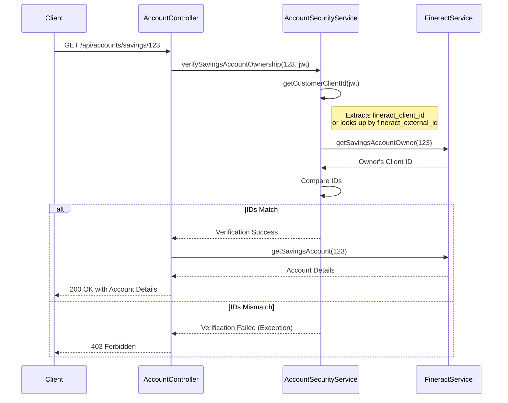

# Account Management: Technical Documentation

## 1. Overview

The Account Management feature provides customers with read-only access to their savings accounts and transaction history. It exposes a set of secure endpoints that allow customers to view their account details and financial activities. A key aspect of this feature is the robust security model that ensures customers can only access their own data.

---

## 2. API Endpoints

### `GET /api/accounts/savings`

Retrieves a list of all savings accounts associated with the authenticated customer.

### `GET /api/accounts/savings/{accountId}`

Retrieves the details of a specific savings account, identified by its `accountId`.

### `GET /api/accounts/savings/{accountId}/transactions`

Retrieves the transaction history for a specific savings account.

---

## 3. Security Model

-   **Authentication:** All endpoints require a valid JWT `Bearer` token in the `Authorization` header.

-   **Authorization:** The service employs a strict ownership verification mechanism to ensure data privacy. The customer's identity is determined from the JWT token in one of two ways:
    1.  **Directly from the `fineract_client_id` claim:** If this claim is present in the JWT, its value is used as the customer's Fineract client ID. This is the preferred and most efficient method.
    2.  **Via the `fineract_external_id` claim:** If the `fineract_client_id` claim is not available, the service uses the `fineract_external_id` claim to look up the corresponding client in Fineract and determine their client ID.

    Before any account information is returned, the service verifies that the Fineract client ID obtained from the token matches the owner of the requested savings account. If there is a mismatch, a `403 Forbidden` error is returned.

### 3.1. Ownership Verification Flow

The ownership verification process is a critical security measure that ensures a customer can only access their own accounts. Here's a step-by-step breakdown of how it works, based on the implementation in `AccountSecurityService`:

1.  **Request Interception**: When a request is made to an account endpoint (e.g., `GET /api/accounts/savings/{accountId}`), the `AccountController` first calls the `AccountSecurityService`'s `verifySavingsAccountOwnership` method before proceeding to fetch the account data.

2.  **Identity Extraction**: The `AccountSecurityService` retrieves the customer's Fineract Client ID from the JWT. It first looks for a `fineract_client_id` claim. If this is not present, it uses the `fineract_external_id` claim to perform a lookup in Fineract to find the corresponding Client ID.

3.  **Ownership Check**: The service then calls the `FineractService` to fetch the details of the requested savings account (`accountId`). This response includes the `clientId` of the account owner.

4.  **Comparison**: The Client ID obtained from the JWT is compared with the `clientId` from the savings account details.

5.  **Access Control**:
    -   If the IDs match, the verification is successful, and the `AccountController` proceeds to fetch and return the account information.
    -   If the IDs do not match, an exception is thrown, resulting in a `403 Forbidden` response to the client.

This flow is visualized in the diagram below:



---

## 4. Account Creation

Savings accounts are not created through the account management endpoints. Instead, a default savings account is automatically created, approved, and activated during the customer registration process.

The following default values, configured in the service's properties, are used for creating the savings account:
-   `productId`: The ID of the Fineract savings product.
-   `locale`: "en"
-   `dateFormat`: "dd MMMM yyyy"

---

## 5. API Responses

### Success Response (`200 OK`) for `GET /api/accounts/savings`

```json
{
    "accounts": [
        {
            "id": 205,
            "accountNo": "000000205",
            "clientId": 102,
            "clientName": "Fatima Diallo",
            "savingsProductId": 1,
            "savingsProductName": "Default Savings Account",
            "status": {
                "id": 300,
                "code": "savingsAccountStatusType.active",
                "value": "Active"
            },
            "timeline": {
                "submittedOnDate": [
                    2023,
                    10,
                    27
                ],
                "approvedOnDate": [
                    2023,
                    10,
                    27
                ],
                "activatedOnDate": [
                    2023,
                    10,
                    27
                ]
            },
            "currency": {
                "code": "XAF",
                "name": "CFA Franc BEAC",
                "decimalPlaces": 0,
                "displaySymbol": "FCFA",
                "nameCode": "currency.XAF",
                "displayLabel": "CFA Franc BEAC (FCFA)"
            },
            "summary": {
                "currency": {
                    "code": "XAF",
                    "name": "CFA Franc BEAC",
                    "decimalPlaces": 0,
                    "displaySymbol": "FCFA",
                    "nameCode": "currency.XAF",
                    "displayLabel": "CFA Franc BEAC (FCFA)"
                },
                "totalDeposits": 0.0,
                "totalWithdrawals": 0.0,
                "totalInterestEarned": 0.0,
                "totalInterestPosted": 0.0,
                "accountBalance": 0.0,
                "totalOverdraftInterestDerived": 0.0,
                "interestNotPosted": 0.0,
                "availableBalance": 0.0
            }
        }
    ]
}
```

### Success Response (`200 OK`) for `GET /api/accounts/savings/{accountId}/transactions`

```json
{
    "transactions": [
        {
            "id": 1,
            "transactionType": {
                "id": 1,
                "code": "transactionType.deposit",
                "value": "Deposit"
            },
            "accountId": 205,
            "accountNo": "000000205",
            "date": [
                2023,
                10,
                28
            ],
            "currency": {
                "code": "XAF",
                "name": "CFA Franc BEAC",
                "decimalPlaces": 0,
                "inMultiplesOf": 0,
                "displaySymbol": "FCFA",
                "nameCode": "currency.XAF",
                "displayLabel": "CFA Franc BEAC (FCFA)"
            },
            "amount": 50000.0,
            "runningBalance": 50000.0,
            "reversed": false,
            "submittedOnDate": [
                2023,
                10,
                28
            ],
            "interestedPostedAsOn": false
        }
    ]
}
```

---

## 6. Local Testing via cURL

### 6.1. Obtain an Access Token

First, obtain a token from Keycloak. This token is required in the `Authorization` header for all subsequent requests.

```bash
export TOKEN=$(curl -s --location --request POST "http://localhost:9000/realms/fineract/protocol/openid-connect/token" \
--header "Content-Type: application/x-www-form-urlencoded" \
--data-urlencode "client_id=setup-app-client" \
--data-urlencode "client_secret=**********" \
--data-urlencode "username=mifos" \
--data-urlencode "password=password" \
--data-urlencode "grant_type=password" | jq -r '.access_token')
```

### 6.2. Test Case: Get All Savings Accounts (SUCCESS)
**Objective:** Verify that a customer can retrieve all their savings accounts.
**Expected Result:** `200 OK`

```bash
curl --location --request GET 'http://localhost:8081/api/accounts/savings' \
--header "Authorization: Bearer $TOKEN"
```

### 6.3. Test Case: Get a Specific Savings Account (SUCCESS)
**Objective:** Verify that a customer can retrieve the details of a specific savings account they own.
**Expected Result:** `200 OK`

```bash
# Replace {accountId} with a valid savings account ID
curl --location --request GET 'http://localhost:8081/api/accounts/savings/{accountId}' \
--header "Authorization: Bearer $TOKEN"
```

### 6.4. Test Case: Get Transactions for a Savings Account (SUCCESS)
**Objective:** Verify that a customer can retrieve the transaction history for a savings account they own.
**Expected Result:** `200 OK`

```bash
# Replace {accountId} with a valid savings account ID
curl --location --request GET 'http://localhost:8081/api/accounts/savings/{accountId}/transactions' \
--header "Authorization: Bearer $TOKEN"
```

### 6.5. Test Case: Attempt to Access Another Customer's Account (FAILURE)
**Objective:** Verify that a customer cannot access an account they do not own.
**Expected Result:** `403 Forbidden`

*Note: This test requires generating a token for a different customer and using an `accountId` that belongs to the first customer.*

```bash
# Replace {accountId} with an account ID not owned by the user associated with $OTHER_USER_TOKEN
export OTHER_USER_TOKEN="..." # Token for a different user
curl --location --request GET 'http://localhost:8081/api/accounts/savings/{accountId}' \
--header "Authorization: Bearer $OTHER_USER_TOKEN"
```
