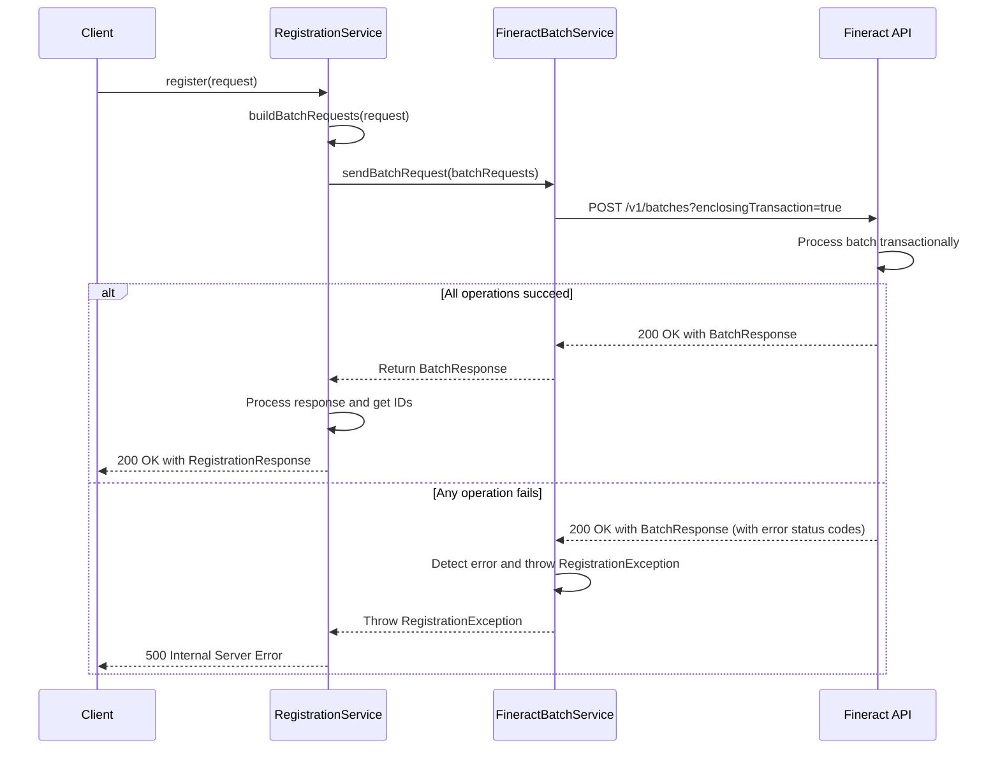

# Fineract Batch API Documentation

This document provides a detailed explanation of the Fineract Batch API and how it is used in the registration process.

## 1. The Concept of Batch Processing

In the context of the Fineract API, batch processing is a powerful feature that allows you to group multiple API requests into a single, atomic operation. This means that you can send a collection of requests to the Fineract server, and it will process them as a single unit.

### 1.1 Why Use Batch Processing?

There are two main advantages to using batch processing:

*   **Performance:** Instead of making multiple HTTP requests to the server, you can send all your requests in a single round trip. This can significantly improve the performance of your application, especially when you need to perform a series of related operations.
*   **Transactional Integrity:** The Fineract Batch API allows you to execute all the requests in the batch within a single database transaction. This is a crucial feature for maintaining data consistency. If any of the requests in the batch fail, the entire transaction is rolled back, and the system is left in the state it was in before the batch was executed. This prevents partial updates and ensures that your data is always in a consistent state.

## 2. The Registration Process as a Batch Operation

The customer registration process is a perfect example of a use case for the Fineract Batch API. The registration process consists of several steps that need to be performed in a specific order:

1.  **Create a new client:** This is the first step in the registration process.
2.  **Create a new savings account:** Once the client has been created, a new savings account is created for them.
3.  **Approve the savings account:** The newly created savings account needs to be approved before it can be used.
4.  **Activate the savings account:** Once the savings account has been approved, it needs to be activated.
5.  **(Optional) Deposit funds:** Finally, an optional initial deposit can be made into the new savings account.

If any of these steps fail, we want to make sure that the entire registration process is rolled back. For example, if the savings account activation fails, we don't want the new client to be left in the system with no savings account. By using the Fineract Batch API, we can ensure that the entire registration process is atomic.

## 3. Implementation Details

### 3.1 The `RegistrationService`

The `RegistrationService` is the main entry point for the registration process. It is responsible for building the batch request and sending it to the Fineract API.

The `register` method in the `RegistrationService` does the following:

1.  **Checks if the client already exists:** Before starting the registration process, it checks if a client with the same external ID already exists in the system. If the client already exists, it checks if they already have a savings account. If they do, it returns the existing client and savings account information.
2.  **Builds the batch request:** If the client does not exist, it builds a list of `BatchRequest` objects for the entire registration process. This includes creating the client, creating the savings account, approving the savings account, activating the savings account, and (optionally) making a deposit.
3.  **Sends the batch request:** It then sends the batch request to the Fineract API using the `FineractBatchService`.
4.  **Processes the batch response:** Finally, it processes the batch response to get the new client ID and savings account ID, and returns them to the caller.

### 3.2 The `FineractBatchService`

The `FineractBatchService` is a generic service that is responsible for sending batch requests to the Fineract API. It does the following:

1.  **Sends the batch request:** It sends the batch request to the `/v1/batches?enclosingTransaction=true` endpoint. The `enclosingTransaction=true` parameter is crucial for ensuring that the entire batch is executed in a single transaction.
2.  **Handles errors:** It checks the status code of each individual response in the batch. If any of the responses has a non-successful status code, it throws a `RegistrationException` with a detailed error message. This ensures that the caller is notified of any failures in the batch.

### 3.3 The DTOs

The following DTOs are used to represent the batch request and response:

*   **`BatchRequest.java`:** Represents an individual request in the batch. It contains the `requestId`, `method`, `relativeUrl`, `headers`, and `body` of the request.
*   **`BatchResponse.java`:** Represents an individual response in the batch. It contains the `requestId`, `statusCode`, `headers`, and `body` of the response.

## 4. The Batch Request Flow

The following diagram illustrates the flow of a batch request during the registration process:

## 5. Review of `account_flow.md`

The `account_flow.md` file documents the account management feature. The cURL commands in this file are for retrieving account information and are not affected by the changes we have made to the registration process. Therefore, the cURL commands in `account_flow.md` do not need to be updated.
