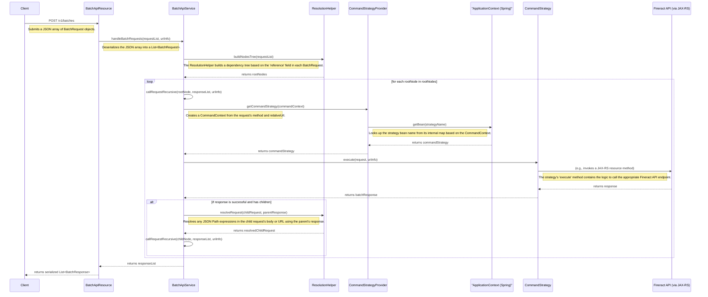

# Fineract Batch API End-to-End Architecture

This document provides a detailed, code-level explanation of the Fineract Batch API's end-to-end architecture, from receiving a request to processing it and returning a response.

## High-Level Overview

The Fineract Batch API allows clients to submit multiple API requests in a single HTTP call. This is particularly useful for improving performance by reducing network latency and for ensuring data consistency by executing all operations within a single transaction.

The core of the batch processing framework is built around the **Strategy** and **Chain of Responsibility** design patterns. The `CommandStrategy` interface defines a common contract for handling different types of API requests (e.g., creating a client, approving a loan), and the `BatchApiService` uses a `CommandStrategyProvider` to select the appropriate strategy for each request at runtime.

## Detailed Architecture Diagram



## Step-by-Step Flow

1.  **Client Request:** The process begins with a client sending a `POST` request to the `/v1/batches` endpoint. The body of this request is a JSON array of `BatchRequest` objects, each representing a single API call.

2.  **Entry Point (`BatchApiResource`):** The JAX-RS resource `BatchApiResource` receives the request. It deserializes the JSON array into a `List<BatchRequest>` and passes it to the `BatchApiService`.

3.  **Dependency Resolution (`ResolutionHelper`):** The `BatchApiService` uses the `ResolutionHelper` to build a dependency tree of the requests. This is done by analyzing the `reference` field in each `BatchRequest`, which allows requests to depend on the successful completion of other requests in the batch.

4.  **Request Execution (`BatchApiService`):** The `BatchApiService` iterates through the root nodes of the dependency tree and recursively executes each request and its children.

5.  **Strategy Selection (`CommandStrategyProvider`):** For each request, the `BatchApiService` calls the `CommandStrategyProvider` to get the appropriate `CommandStrategy`. The provider uses a `Map` to match the request's `method` and `relativeUrl` to the name of a Spring bean that implements the `CommandStrategy` interface.

6.  **Strategy Execution:** The `BatchApiService` then invokes the `execute` method on the selected `CommandStrategy`. Each strategy contains the specific logic for calling a particular Fineract API endpoint.

7.  **API Invocation:** The `CommandStrategy` makes a call to the appropriate Fineract API endpoint, typically by invoking a method on another JAX-RS resource.

8.  **Response Handling:** The `CommandStrategy` receives the response from the Fineract API and wraps it in a `BatchResponse` object.

9.  **Dependency Resolution (Post-execution):** If a request was successful and has dependent child requests, the `BatchApiService` uses the `ResolutionHelper` again to resolve any placeholders (using JSON Path) in the child requests with values from the parent's response.

10. **Final Response:** After all requests in the batch have been processed, the `BatchApiService` returns a `List<BatchResponse>` to the `BatchApiResource`, which then serializes it to JSON and sends it back to the client.

## How to Use it in Your Own Application

To use the Fineract Batch API in your application, you need to:

1.  **Construct a Batch Request:** Create a JSON array of `BatchRequest` objects. Each object should have the following properties:
    *   `requestId`: A unique identifier for the request within the batch.
    *   `method`: The HTTP method (e.g., "POST", "PUT", "GET", "DELETE").
    *   `relativeUrl`: The URL of the Fineract API endpoint you want to call (e.g., "v1/clients").
    *   `headers`: An optional array of HTTP headers.
    *   `reference`: An optional reference to the `requestId` of another request in the batch that this request depends on.
    *   `body`: The JSON body of the request (for POST and PUT requests).

2.  **Send the Request:** Send an HTTP `POST` request to the `/v1/batches` endpoint with the JSON array as the request body.

3.  **Process the Response:** The response will be a JSON array of `BatchResponse` objects, each corresponding to one of the requests in your batch. You can then process these responses to check the status of each individual operation.

### Example

Here's an example of a batch request that creates a new client and then creates a new savings account for that client:

```json
[
    {
        "requestId": 1,
        "method": "POST",
        "relativeUrl": "v1/clients",
        "body": "{'officeId':1,'firstname':'John','lastname':'Doe','externalId':'johndoe','dateFormat':'dd MMMM yyyy','locale':'en','active':true,'activationDate':'01 January 2024'}"
    },
    {
        "requestId": 2,
        "method": "POST",
        "relativeUrl": "v1/savingsaccounts",
        "reference": 1,
        "body": "{'clientId':'$.clientId','productId':1,'dateFormat':'dd MMMM yyyy','locale':'en','submittedOnDate':'01 January 2024'}"
    }
]
```

In this example, the second request has a `reference` to the first request. The `clientId` in the body of the second request is a JSON Path expression that will be replaced with the `clientId` from the response of the first request.
