# Account Manager App: Your Guide to Managing Client Accounts

Welcome to the Account Manager App! This guide will walk you through everything you need to know to manage client accounts effectively. We've designed it to be simple, clear, and focused on what you do every day.

---

## Table of Contents

1.  [Getting Started: A Quick Look](#1-getting-started-a-quick-look)
2.  [Logging Into Your Account](#2-logging-into-your-account)
3.  [Your Home Base: The Client Dashboard](#3-your-home-base-the-client-dashboard)
4.  [Adding a New Liquidity Provider](#4-adding-a-new-liquidity-provider)
5.  [The Client Types Explained](#5-the-four-client-types-explained)
6.  [Reading Transaction Histories](#7-reading-transaction-histories)
7.  [Important: Actions You Can't Undo](#8-important-actions-you-cant-undo)
8.  [Simple Definitions of Key Terms](#10-simple-definitions-of-key-terms)

---

## 1. Getting Started: A Quick Look

The Account Manager App is your tool for overseeing all client activity. It’s designed to give you a clear, simple view of every account on the platform.

**What you can do:**

*   **See Everyone:** View a full list of clients and what type of account they have.
*   **Check Balances:** Look into any client's accounts to see their assets and cash.
*   **Track Transactions:** Review all the money and assets moving in and out of accounts.
*   **Add New Liquidity Providers:** Create new accounts for Liquidity Providers.

Think of it as your central hub for all client financial information.

---

## 2. Logging Into Your Account

Getting into the app is easy.

**Step 1: Go to the App Website**
Open your web browser and enter the URL your administrator gave you.

**Step 2: Enter Your Login Details**
Type in your email and password.

**Step 3: Click "Log In"**
You’ll be taken straight to your dashboard.

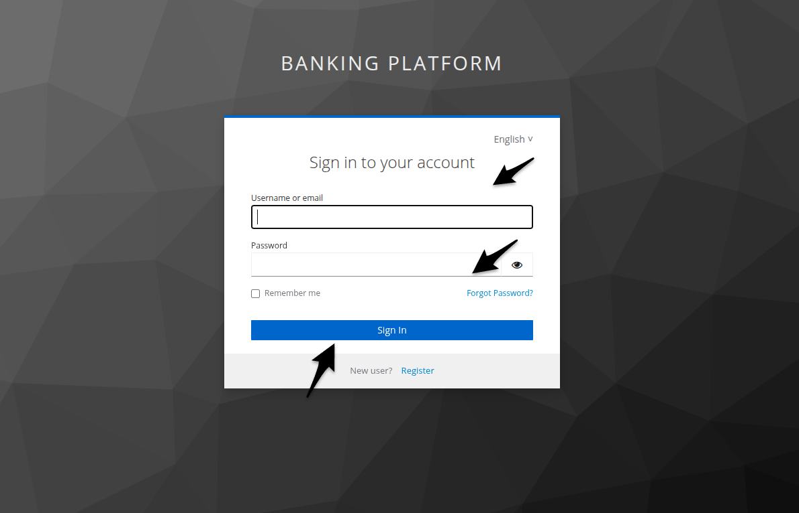

> ** Tip:** If you can't remember your password, click the "Forgot Password?" link and follow the instructions sent to your email.

---

## 3. Your Home Base: The Client Dashboard

The first thing you'll see after logging in is the main dashboard. This is where you can see all your clients at a glance.

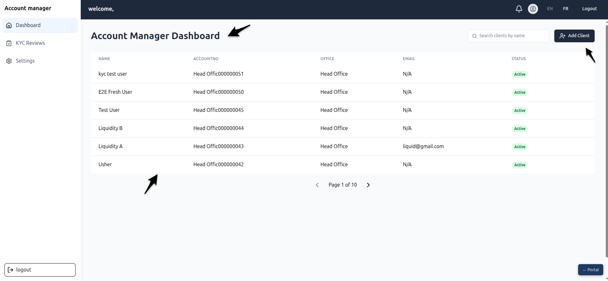

**What’s on the Dashboard?**

*   **Client List:** A table showing every client on the platform.
*   **Client Name & Type:** Who the client is and their role (e.g., Customer, Liquidity Provider).
*   **Status:** A quick check to see if an account is `Active` or `Inactive`.
*   **Create Client Button:** Your tool for adding new Liquidity Providers.

**How to Find a Client Quickly**

Use the search bar at the top of the list to find a client by name.

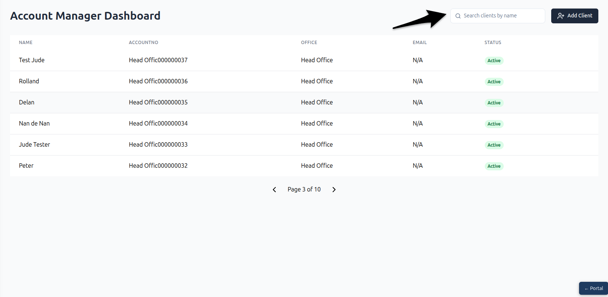

---

## 4. Adding a New Liquidity Provider

You can add new **Liquidity Providers** directly from your dashboard. This is the only type of client you can create yourself.

**Step 1: Click "Create Client"**
Find and click the "Create Client" button on the dashboard to open the form.

**Step 2: Fill in the Details**
Enter the new provider's information. You'll need ro select ClientType, Liquidity Provider  name, email, and phone number. You can also set the account to be active right away.

**Step 3: Click "Create"**
Once you've checked that the details are correct, click "Save" Buttone The new Liquidity Provider Client  will now appear on your client list.

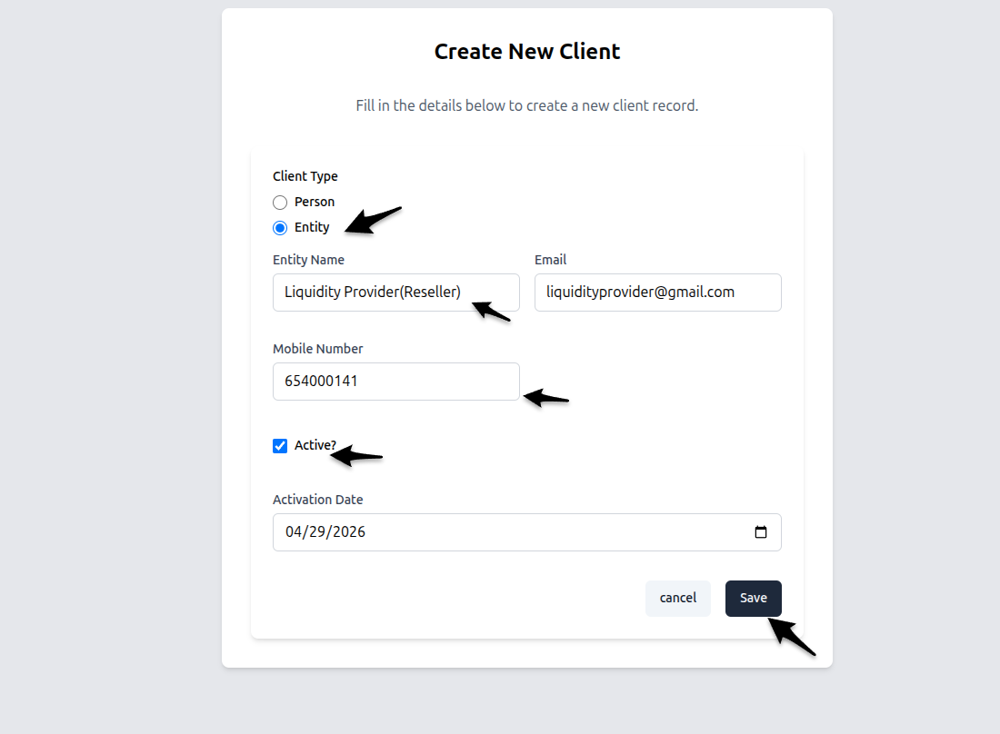

---

## 5. The  Client Types Explained

 Here’s what  you need to know about the type of Clients and what they are able to do.

### 5.1. Liquidity Providers

These are organizations or resellers that supply assets to the platform. The Liquidity Provider has four Accounts when created 

*   **Treasury Account:** Holds their assets (like securities or tokens).
*   **Cash Account:** Holds their cash from asset sales.
*   **LPSpreadAccount:** Holds the Spread fee in XAF.
*   **LPTaxWithHoldingAccount:** Hold the all Tax cash in XAF.

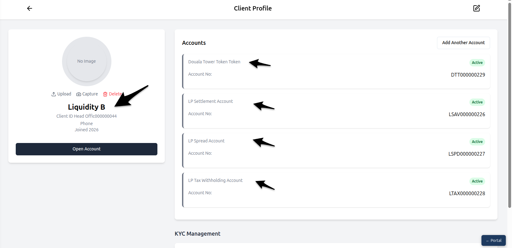

### 5.2. Customers

These are the end-users who buy and sell assets using the mobile app. They appear on your dashboard automatically after they register, get approved, and make their first deposit.

*   **Asset Savings Account:** Holds the assets they've bought.
*   **Cash Savings Account:** Holds their cash for buying assets or from selling them.

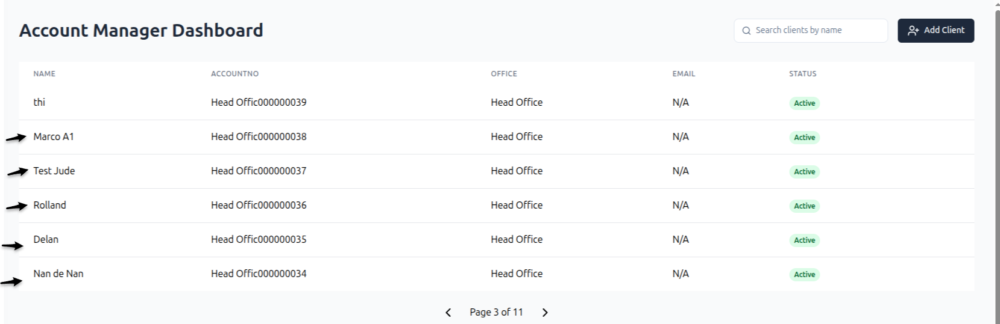

### 5.2.1 Exploring a Client's Accounts

Here’s how to look into any client's accounts.

**Step 1: Click on a Client**
From the dashboard, click on any client's name to open their profile.

**Step 2: Choose an Account**
You'll see a list of their accounts Cash Account and Asset Account. Click the one you want to see.

**Step 3: Review the Details**
You can now see the account's balance and a full list of its transactions.

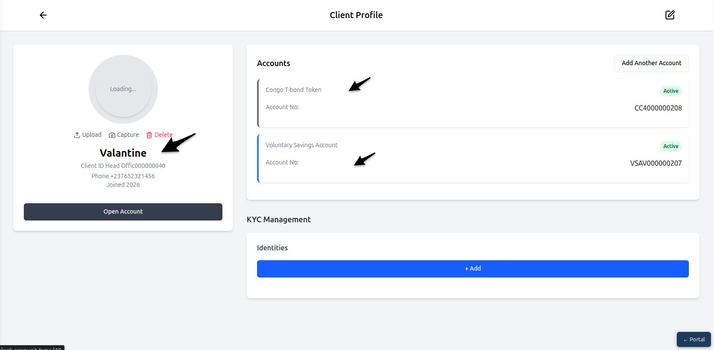

### 5.3. Platform Fee Collector

This is an automatic account that collects the service fees from transactions. It’s created by the system when a new asset is made available.

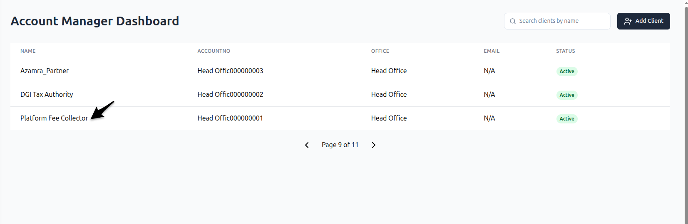

*   **Cash Account:** Below show details of how the platform holds all the fees collected.

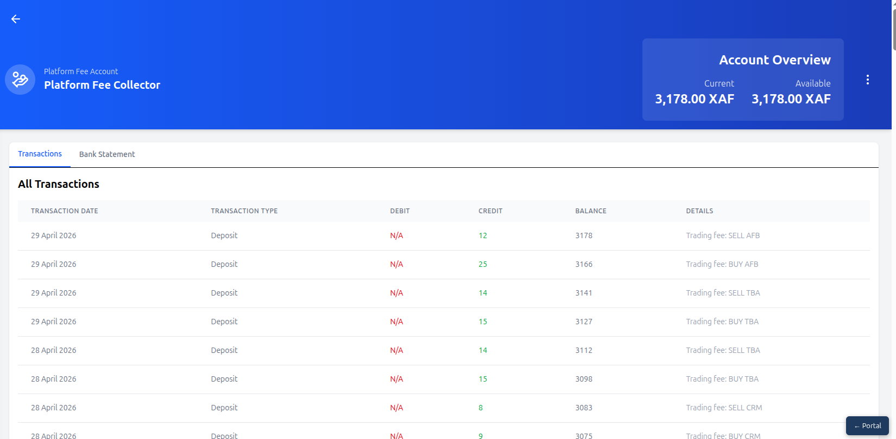

### 5.4. Tax Authority

This is another automatic account that collects taxes from transactions. It’s also created by the system along with the Platform Fee Collector.

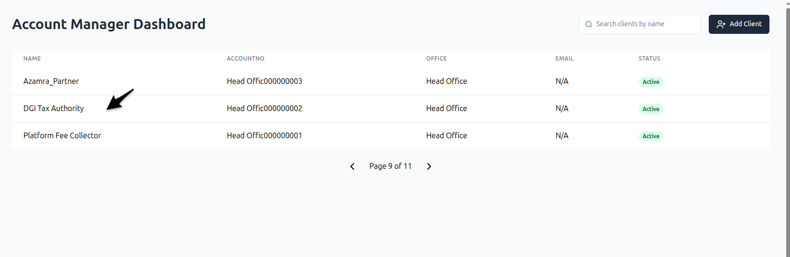

*   **Cash Account:** Below show details of how the tax fees collected.

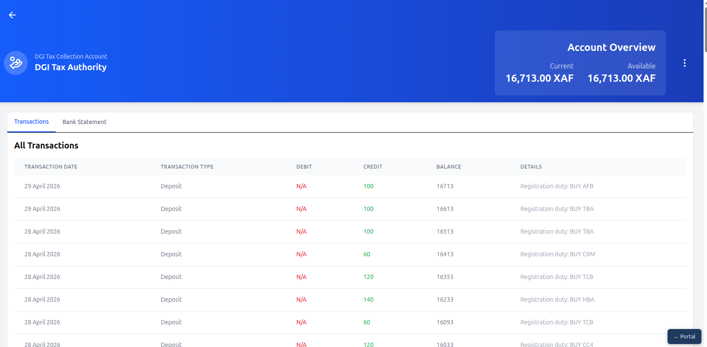

---

## 6. Reading Transaction Histories

Every account has a history of all the money or assets that have moved through it.

*   **Credit:** Money or assets coming **INTO** the account.
*   **Debit:** Money or assets going **OUT OF** the account.

The transaction table shows you the date, a description of the transaction, the amount, and the running balance of a Customer showing how money id been deposited and withdrawed!

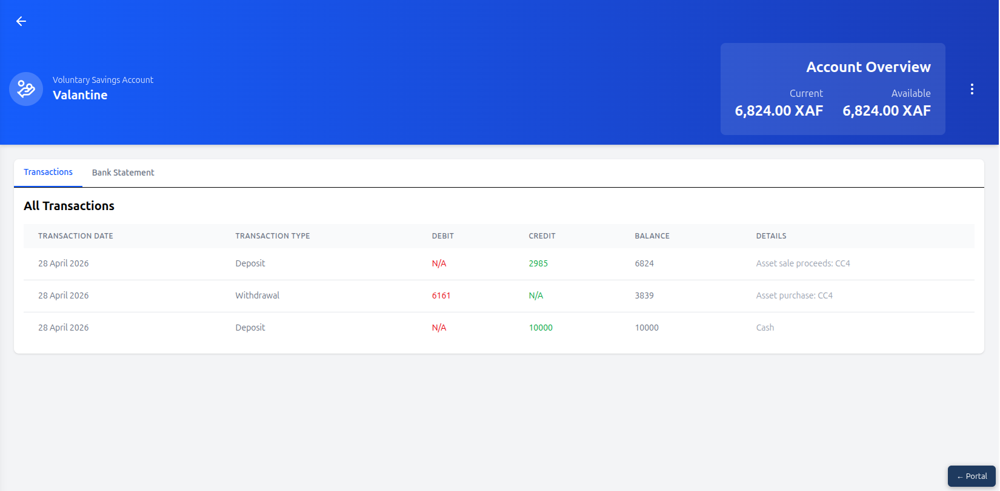

---

## 7. Important: Actions You Can't Undo

>  **READ THIS CAREFULLY**

There is one action in the app that is **permanent** and can have a big impact.

###  Blocking an Account

Inside every savings account, there is a **"Block Account"** button.

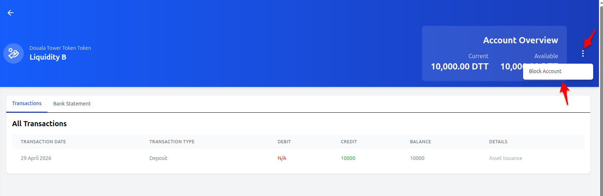

**What it does:**
This will instantly freeze the account. No money or assets can move in or out until it is unblocked.

**When to use it:**
**NEVER** click this button unless a supervisor or system administrator has told you to. It is not reversible by you and will immediately stop the client from being able to use their account.

**What to do if you click it by mistake:**
Contact your system administrator right away.

---

## 8. Simple Definitions of Key Terms

| Term | Definition |
|---|---|
| **Account Manager** | The user of this app — responsible for managing and monitoring all client accounts on the platform |
| **Liquidity Provider** | A reseller or organisation that holds assets and provides them to customers on the platform |
| **Customer** | An end user who buys or sells assets through the mobile application |
| **Platform Fee Collector** | A system account that automatically accumulates service fees from every buy/sell transaction |
| **Tax Authority** | A system account that holds all government tax collected from transactions on the platform |
| **Treasury Account** | A savings account held by Liquidity Providers that stores assets (not cash) |
| **Cash Account** | A savings account that holds cash — exists for all client types |
| **Asset Savings Account** | A savings account held by Customers that stores purchased assets |
| **Debit** | An outgoing amount — money or assets leaving an account |
| **Credit** | An incoming amount — money or assets entering an account |
| **Block Account** | An action that prevents a savings account from sending or receiving funds |
| **Active** | A client account that is enabled and can transact on the platform |
| **Inactive** | A client account that has been disabled and cannot transact |
| **Set Creation Date** | The date from which a new client account is considered to exist in the system |

---