# Admin Application User Guide (Detailed)

## 1. Introduction

Welcome to the Admin Application. This guide is designed to be a detailed, step-by-step walkthrough of all the functionalities available to you. As the administrator, you are responsible for managing user access to all banking applications, including the Asset Manager App, KYC Manager App, Cashier App, Account Manager App, and others. This guide will ensure you can perform all necessary tasks with confidence.

---

## 2. Getting Started: First-Time Login and Securing Your Account

Your first and most important task is to secure your own administrator account.

### 2.1. Initial Login

You will receive a temporary username and password from the support team. Use these credentials to log in to the application.

**Step 1:** Open the Admin Application URL provided to you.
**Step 2:** Enter your temporary username and password.
**Step 3:** Click the "Login" button.

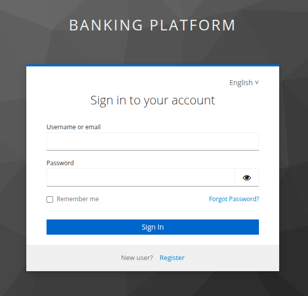

### 2.2. Resetting Your Own Password

For security reasons, you must immediately reset your password after your first login. As an admin, you are also a user in the system, so you will use the standard user management tools to reset your own password.

**Step 1:** After logging in, you will be on the main dashboard. Click on the **"Manage Users"** card to go to the user list.

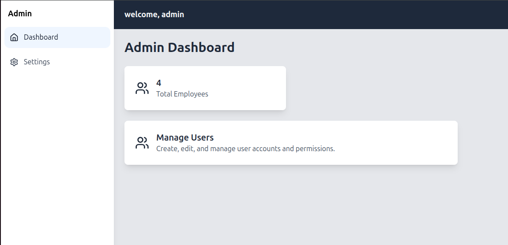

**Step 2:** On the User List page, find your own username in the table. You can use the search bar to quickly find your account.

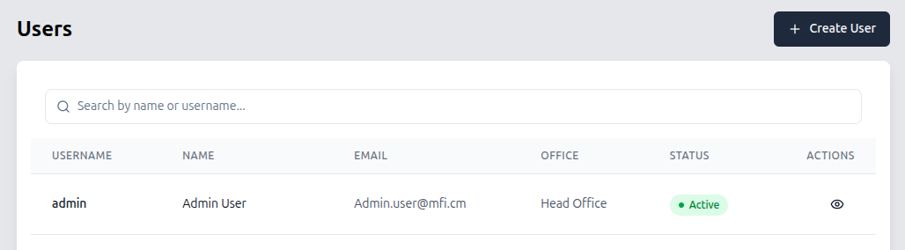

**Step 3:** Click on your user row to open your own **User Details** page.

**Step 4:** On your User Details page, click the **"Reset Password"** button located at the top-right of the page.

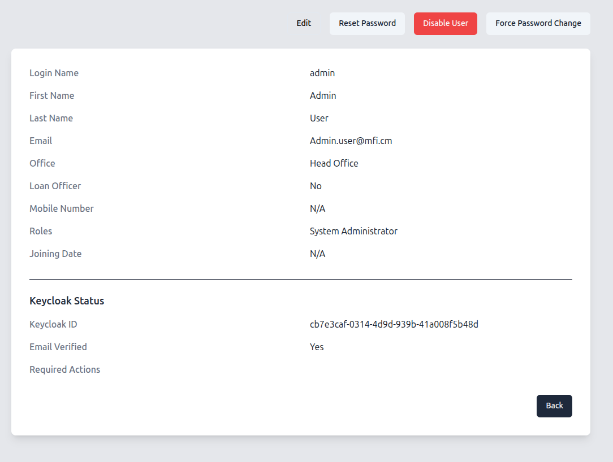

**Step 5:** A confirmation dialog will appear. Click "Confirm". An email will be sent to your registered email address.

**Step 6:** Open the email and follow the instructions to set a new, secure password.

---

## 3. Navigating the Dashboard

The dashboard is your main control center. It provides an at-a-glance overview of the system's users.

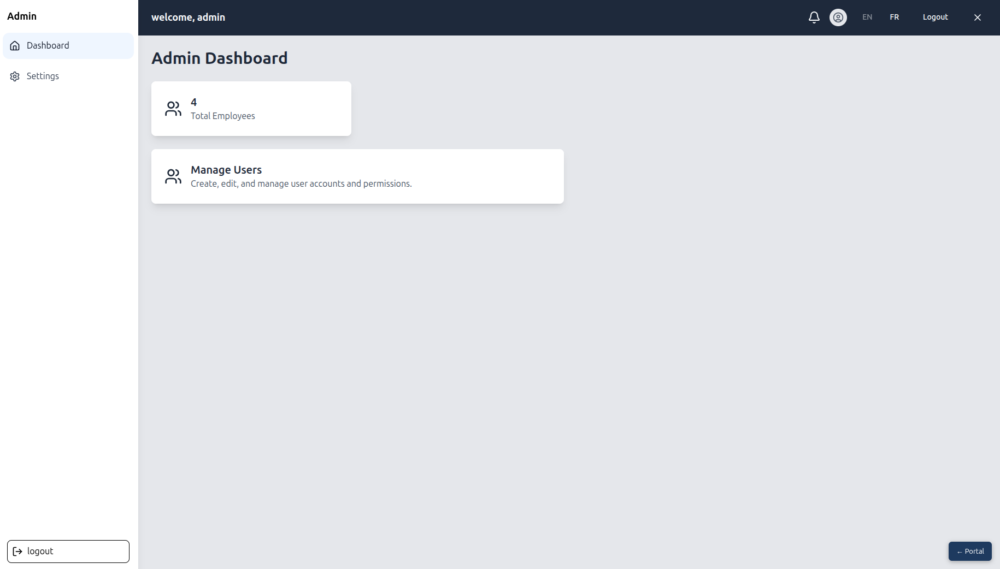

When you arrive on the dashboard, you will see:

* **A Welcome Title**: "Admin Dashboard".
* **Two main cards**:

    1. **Total Employees Card**: This card displays the total number of active users in the system.
    2. **Manage Users Card**: This is your gateway to all user management tasks.

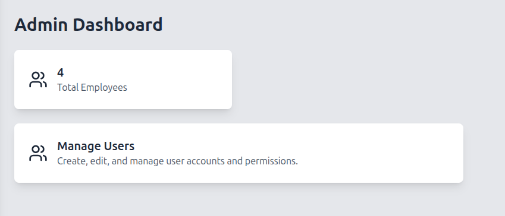

**Next Step:** To begin managing users, click anywhere on the **Manage Users** card.

---

## 4. User Management

Clicking the "Manage Users" card will take you to the **User List** page. This is where you will perform most of your day-to-day tasks.

### 4.1. Creating a New User

**Step 1:** From the User List page, click the **"Create User"** button at the top-right of the page.

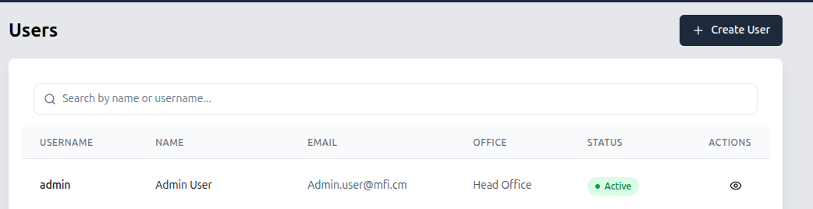

This will take you to the **Create User** form.

**Step 2:** Fill out the form with the new user's information:

* **First Name**: The user's first name.
* **Last Name**: The user's last name.
* **Username**: The username they will use to log in.
* **Email**: The user's email address. This is where they will receive password reset emails.
* **Office**: Select the office or branch the user belongs to from the dropdown menu.
* **Roles**: Select one or more roles for the user from the list.

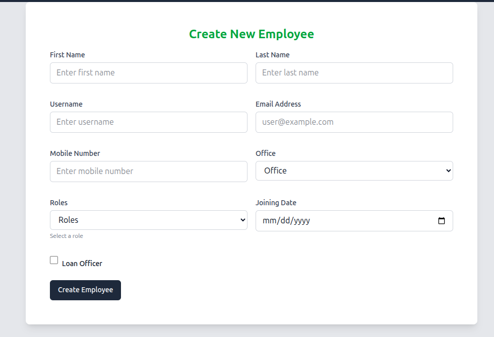

**Step 3:** Once you have filled in all the details, click the **"Create Employee"** button.

**The user will be created, but they will not have a password yet. The next step is to send them a password creation link.**

### 4.2. Setting a New User's Password

**This is a critical step.** After creating a user, you must immediately send them a password reset email so they can set their own password and log in for the first time.

**Step 1:** After submitting the "Create User" form, you will be returned to the User List page. The user you just created will now be in the table.
**Step 2:** Find the new user in the list. You can use the search bar if needed.
**Step 3:** Click on the new user's row to navigate to their **User Details** page.
**Step 4:** On the User Details page, click the **"Reset Password"** button.

**Step 5:** Confirm the action in the dialog box. This will send an email to the new user's email address with a link for them to create their password.

### 4.3. The User List Page

This page displays a table with all the users in the system.

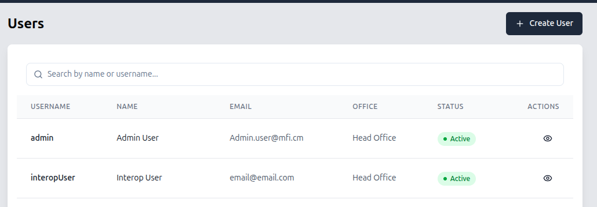

The table includes the following columns:

* **Username**: The user's login name.
* **Name**: The user's full name.
* **Office**: The branch or office the user belongs to.
* **Roles**: The roles assigned to the user.
* **Status**: The user's current account status (e.g., Active, Inactive).

### 4.4. The User Details Page

This page shows all the information about a specific user and provides you with the tools to manage their account.

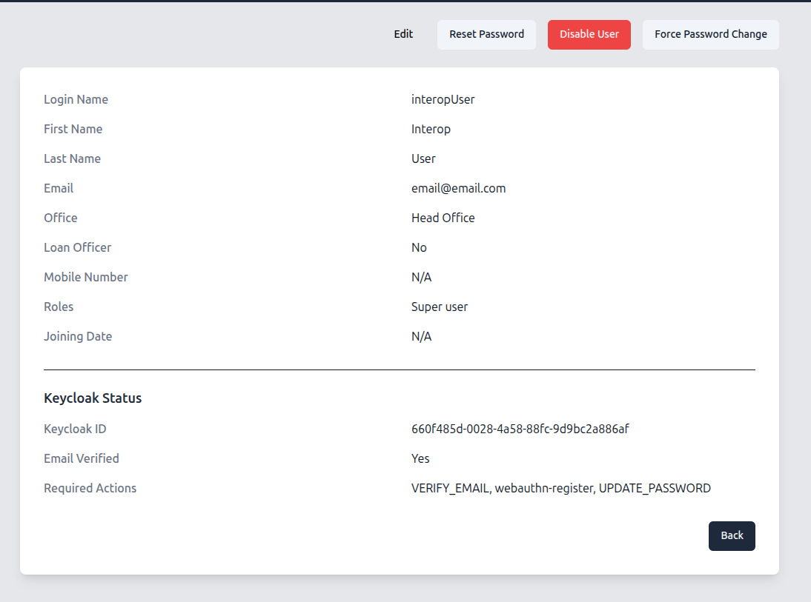

On this page, you will see:

* **User Information**: The user's full name, username, email, office, and assigned roles.
* **Action Buttons**: A set of buttons at the top-right of the page that allow you to perform security-related actions.

Let's go through each action button.

#### 4.4.1. Disabling a User

When an employee leaves the company or no longer requires access, you must disable their account.

**Step 1:** On the User Details page, click the **"Disable User"** button.
**Step 2:** A confirmation dialog will appear. Click "Confirm".

The user's account will be immediately deactivated, and they will no longer be able to log in.

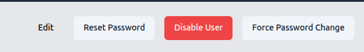

#### 4.4.2. Resetting a User's Password

This action is used in two scenarios:

1. To allow a new user to set their password for the first time.
2. To help an existing user who has forgotten their password.

**Step 1:** On the User Details page, click the **"Reset Password"** button.
**Step 2:** A confirmation dialog will appear. Click "Confirm".

This will trigger an email to the user with a link to reset their password.

#### 4.4.3. Forcing a Password Change

If you suspect a user's account may be compromised, you can force them to change their password on their next login.

**Step 1:** On the User Details page, click the **"Force Password Change"** button.
**Step 2:** A confirmation dialog will appear. Click "Confirm".

The next time the user tries to log in, they will be prompted to create a new password.

)

---

## 5. Understanding Roles

Assigning the correct roles is the most important part of user creation. Roles determine which applications a user can access and what actions they can perform.

Here is a summary of the most common roles:

* **Kyc Manager**: For logging into the KYC app.
* **Asset Manager**: For managing assets.
* **Admin**: Has access to this Admin Application to manage users.
* **Branch Manager**: Can approve loans and manage staff within their branch.
* **Teller**: Can perform transactions in the Cashier Application.

Always follow the principle of least privilege: only grant users the roles they absolutely need to perform their job.

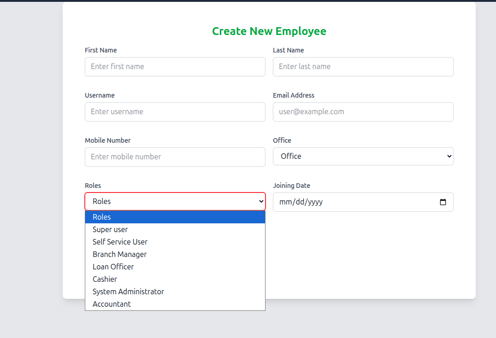
