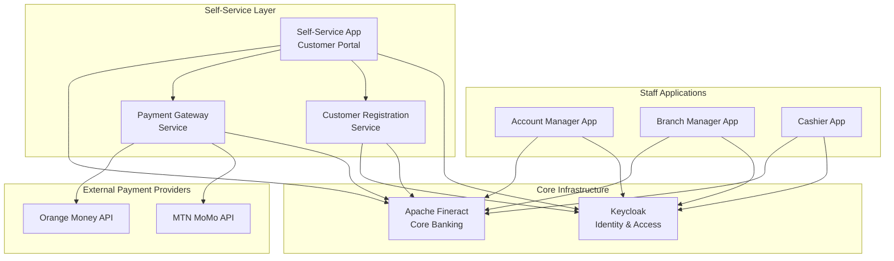
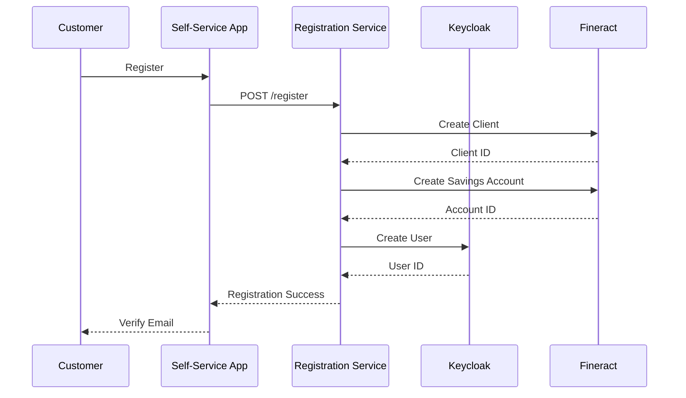
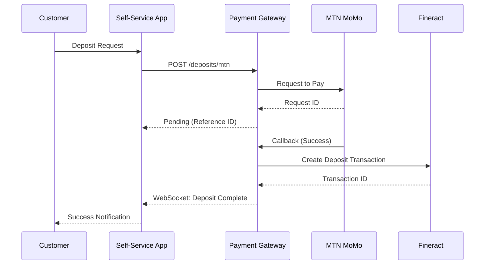
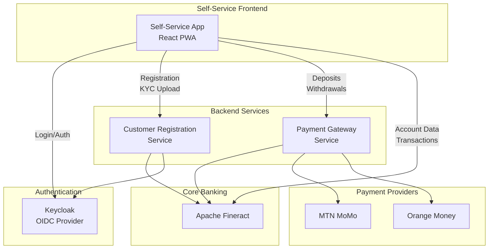
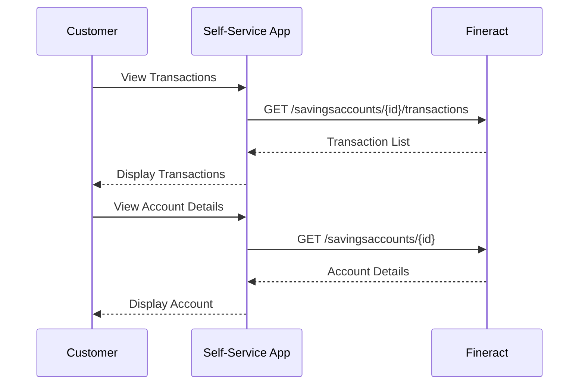
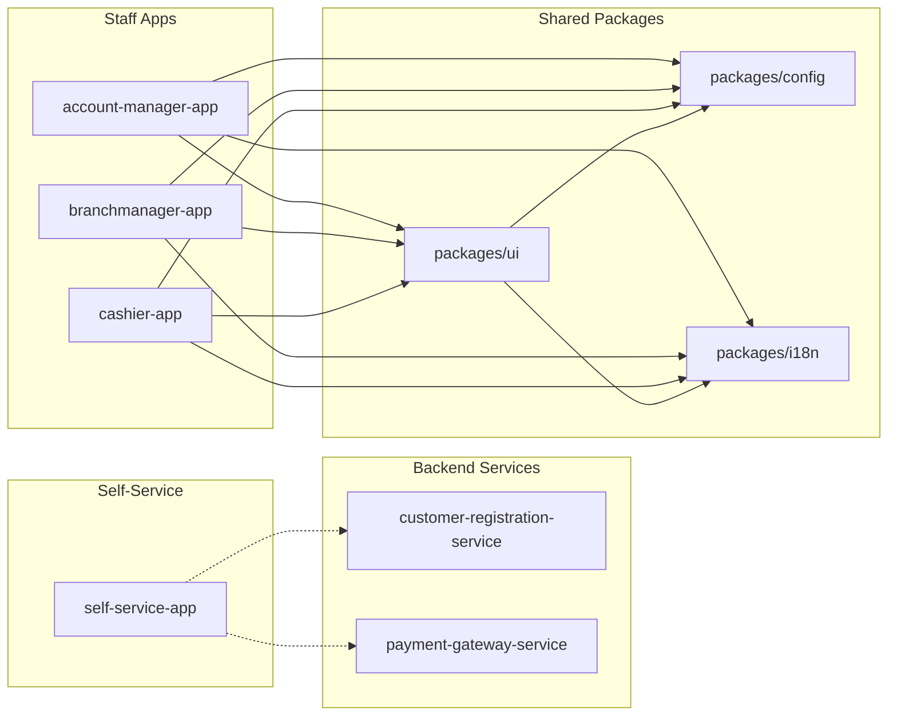
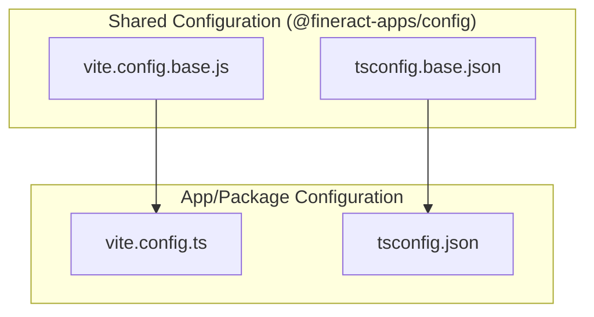
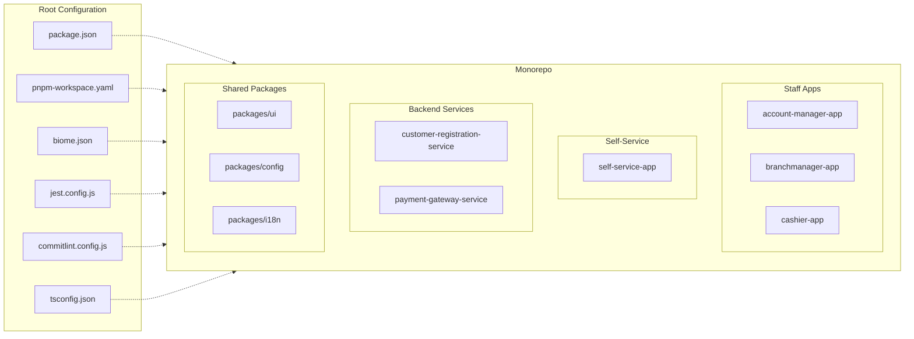

# Architecture Guide

This guide provides a high-level overview of the project's architecture, focusing on the relationships between the different parts of the monorepo.

## High-Level System Architecture

The complete system includes staff-facing applications, a self-service customer portal, and supporting backend services. The following diagram shows the overall architecture:

### Self-Service Layer Components

| Component | Description | Technology |
|-----------|-------------|------------|
| Self-Service App | Customer-facing PWA for mobile money transactions | React, TanStack Router, PWA |
| Customer Registration Service | Handles customer onboarding and KYC | Spring Boot, REST API |
| Payment Gateway Service | Integrates MTN MoMo and Orange Money | Spring Boot, REST API |

### Data Flow: Customer Registration

### Data Flow: Mobile Money Deposit

### Self-Service App Architecture

The following diagram shows how the Self-Service App connects to various backend components:

### Data Flow: View Transactions/Account

For read-only operations like viewing account details or transactions, the Self-Service App calls Fineract directly:

### Self-Service API Routing

The following table explains which operations go through which services:

| Operation | Route | Reason |
|-----------|-------|--------|
| Login/Auth | SSA → Keycloak | OIDC authentication |
| View account | SSA → Fineract (direct) | Read-only, no business logic needed |
| View transactions | SSA → Fineract (direct) | Read-only, no business logic needed |
| Registration | SSA → CRS → Fineract/KC | Creates accounts in multiple systems |
| KYC upload | SSA → CRS → Fineract | Needs validation, status tracking |
| Deposits | SSA → PGS → MTN/Orange → Fineract | Payment provider integration |
| Withdrawals | SSA → PGS → MTN/Orange → Fineract | Payment provider integration |

## Monorepo Structure and Dependencies

The project is organized as a monorepo with a clear separation between applications and shared packages. The following diagram illustrates the dependencies between the different namespaces:

## Configuration Management

The project uses a shared configuration approach to ensure consistency across all applications and packages. Base configuration files are located in the `@fineract-apps/config` package and are imported by the individual projects.

The following diagram shows the configuration inheritance model:

This setup allows for centralized management of common settings while providing flexibility for project-specific overrides. The shared configurations are imported as modules, thanks to the pnpm workspace setup.

## Root Configuration

The monorepo is governed by several root-level configuration files that apply to all packages and applications.

*   **`package.json`**: The root `package.json` file defines scripts for the entire monorepo (e.g., `dev`, `build`, `lint`) and contains the development dependencies required for the whole project.
*   **`pnpm-workspace.yaml`**: This file defines the workspaces in the monorepo, telling `pnpm` where to find the different applications and packages.
*   **`biome.json`**: This is the configuration file for Biome, which is used for linting and formatting the entire codebase to ensure a consistent style.
*   **`jest.config.js`**: This file configures Jest, the framework used for running tests across the monorepo.
*   **`commitlint.config.js`**: This file configures commitlint, which enforces conventional commit messages to maintain a clean and readable version history.
*   **`tsconfig.json`**: This is the base TypeScript configuration for the entire project. Each package and application extends this base configuration.

The following diagram illustrates how these root configuration files apply to all projects within the monorepo:

