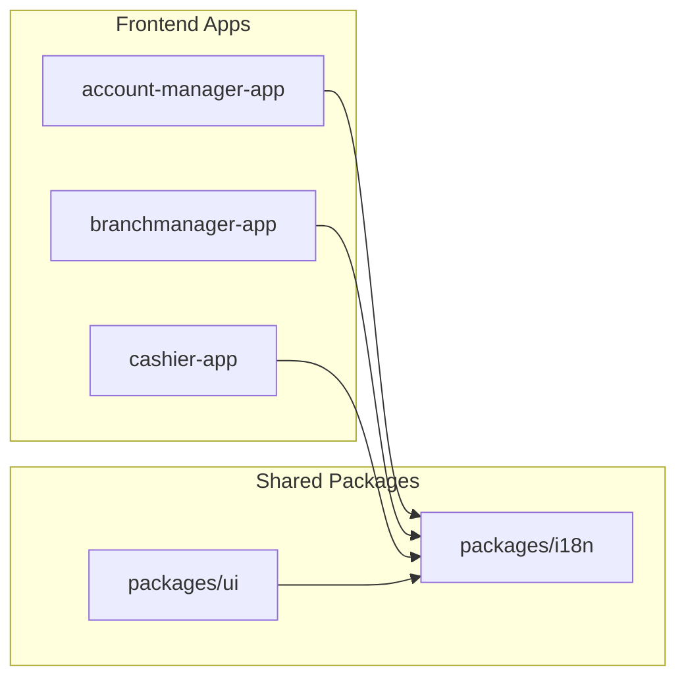

# Internationalization (i18n) Guide

This document is the complete guide to the internationalization (i18n) system in this monorepo. It is divided into two main sections:

1.  **Technical Guide**: For developers who need to understand, maintain, or extend the i18n system.
2.  **Developer Guide**: For developers who are building features and need to add or use translations.

---

## 1. Technical Guide

This section provides a deep dive into the architecture and implementation of the i18n system.

### 1.1. Core Strategy & Architecture

Our i18n strategy is built around a centralized, shared package (`@fineract-apps/i18n`) that is consumed by all frontend applications and the shared UI library. This ensures a single source of truth for all translations and a consistent implementation across the project.

The system is powered by the following core libraries:
-   **`i18next`**: The core internationalization framework.
-   **`react-i18next`**: Provides React bindings for `i18next`, including the essential `useTranslation` hook.
-   **`i18next-browser-languagedetector`**: A plugin to automatically detect the user's language from their browser settings.

The following diagram illustrates the dependency graph:



### 1.2. The `@fineract-apps/i18n` Package

This package is the heart of the i18n system.

#### File Structure
```
packages/i18n/
├── package.json
├── tsconfig.json
└── src/
    ├── i18n.ts
    ├── index.ts
    └── locales/
        ├── en.json                 # Shared/common English translations
        ├── fr.json                 # Shared/common French translations
        ├── account-manager/        # Feature-specific translations
        │   ├── en.json
        │   └── fr.json
        ├── accounting/
        │   ├── en.json
        │   └── fr.json
        └── ... (other apps)
```

#### Core Configuration (`src/i18n.ts`)
This file is responsible for initializing `i18next`.

```typescript
import i18n from "i18next";
import { initReactI18next } from "react-i18next";
import LanguageDetector from "i18next-browser-languagedetector";

// Import shared translations
import en from "./locales/en.json";
import fr from "./locales/fr.json";

// Import feature-specific translations
import enAccountManager from "./locales/account-manager/en.json";
import frAccountManager from "./locales/account-manager/fr.json";
import enAccounting from "./locales/accounting/en.json";
import frAccounting from "./locales/accounting/fr.json";
// ... import other translations

i18n
  .use(LanguageDetector)
  .use(initReactI18next)
  .init({
    fallbackLng: "en",
    debug: import.meta.env.DEV,
    interpolation: {
      escapeValue: false,
    },
    resources: {
      en: {
        translation: {
          ...en.translation,
          ...enAccountManager.translation,
          ...enAccounting.translation,
          // ... other English translations
        },
      },
      fr: {
        translation: {
          ...fr.translation,
          ...frAccountManager.translation,
          ...frAccounting.translation,
          // ... other French translations
        },
      },
    },
  });

export default i18n;
```

### 1.3. Integration with Applications

For the i18n system to work, it must be initialized once when an application starts. This is done by importing the package in the entry point of each frontend application.

```typescript
// Example: frontend/cashier-app/src/main.tsx
import "@fineract-apps/i18n"; // This line initializes the i18n service
// ... rest of the file
```

### 1.4. The `LanguageSwitcher` Component

To give users manual control over the language, the shared `LanguageSwitcher` component was created in the `@fineract-apps/ui` package.

It uses the `i18n.changeLanguage()` function provided by `react-i18next` to change the language for the entire application in real-time.

```tsx
// packages/ui/src/components/LanguageSwitcher/LanguageSwitcher.view.tsx
import { useTranslation } from "react-i18next";
import { Button } from "../Button";

export const LanguageSwitcher = () => {
  const { i18n } = useTranslation();

  return (
    <div className="flex gap-2">
      <Button onClick={() => i18n.changeLanguage("en")}>EN</Button>
      <Button onClick={() => i18n.changeLanguage("fr")}>FR</Button>
    </div>
  );
};
```

---

## 2. Developer Guide

This section provides a practical, step-by-step guide for using the i18n system in your daily development workflow.

### **IMPORTANT: Translations Are Not Automatic**

The i18n system provides the *framework* for translations, but it does **not** automatically translate new text. **Every piece of text that you add to the UI must be explicitly connected to the i18n system by following the steps below.**

### 2.1. Workflow: Adding a New Translation

Follow these steps every time you add new user-visible text to a component.

#### Step 1: Choose a Translation Key

First, decide on a unique, descriptive key for your new text. It's best practice to use a structured, lowercase format (e.g., `userProfile.welcomeMessage`, `buttons.save`).

#### Step 2: Add the Key to the Correct JSON File

Locate the correct translation file for your feature. For example, if you are working in the **Account Manager** app, you would open `packages/i18n/src/locales/account-manager/en.json`. If the translation is for a shared component in `@fineract-apps/ui`, add it to the root `packages/i18n/src/locales/en.json`.

Add your new key with its English translation.

```json
{
  "translation": {
    "welcome": "Welcome",
    "userProfile": {
      "welcomeMessage": "Hello and welcome to your profile!"
    }
  }
}
```

#### Step 3: Add the Key to the Corresponding French File

Open the corresponding `fr.json` file (e.g., `packages/i18n/src/locales/account-manager/fr.json`) and add the **exact same key** with its French translation.

```json
{
  "translation": {
    "welcome": "Bienvenue",
    "userProfile": {
      "welcomeMessage": "Bonjour et bienvenue sur votre profil!"
    }
  }
}
```

### 2.2. Workflow: Using a Translation in a Component

Once your keys are in the JSON files, you can use them in any React component.

#### Step 1: Import the `useTranslation` Hook

At the top of your component file, import the `useTranslation` hook.

```tsx
import { useTranslation } from "react-i18next";
```

#### Step 2: Call the Hook and Get the `t` Function

Inside your component, call the hook to get the translation function, which is conventionally named `t`.

```tsx
function MyComponent() {
  const { t } = useTranslation();
  // ...
}
```

#### Step 3: Understanding and Using the `t` Function

The `t` function is the core of `react-i18next`. Here is what you need to know:

*   **What is it?** The `t` function is the **translation function**. Its job is to take a key (like `"userProfile.welcomeMessage"`) and return the corresponding string from the correct language file (`en.json` or `fr.json`) based on the currently active language.
*   **Where does it come from?** It is provided by the `useTranslation` hook, which is the official hook from the `react-i18next` library.
*   **How does it work?** When the language changes (either automatically or through the `LanguageSwitcher`), the `useTranslation` hook detects this change and causes your component to re-render. When it re-renders, the `t` function will now return the translations for the new language.

#### Step 4: Use the `t` Function to Display Text

Call the `t` function with the key you created. It will automatically return the correct string for the currently selected language.

```tsx
function MyComponent() {
  const { t } = useTranslation();

  return (
    <div>
      <h1>{t("userProfile.welcomeMessage")}</h1>
    </div>
  );
}
```

### 2.3. Advanced: Translations with Dynamic Data

If your text needs to include dynamic values (like a username), you can use interpolation.

#### Step 1: Add a Placeholder to Your JSON Files

In your translation files, add a placeholder using double curly braces `{{...}}`.

```json
// en.json
"welcomeUser": "Welcome, {{name}}!"

// fr.json
"welcomeUser": "Bienvenue, {{name}}!"
```

#### Step 2: Pass the Data to the `t` Function

In your component, pass an object with the dynamic data as the second argument to the `t` function.

```tsx
function UserGreeting({ userName }: { userName: string }) {
  const { t } = useTranslation();

  return <h1>{t("welcomeUser", { name: userName })}</h1>;
}
```
This will render "Welcome, John!" if `userName` is "John" and the language is English.