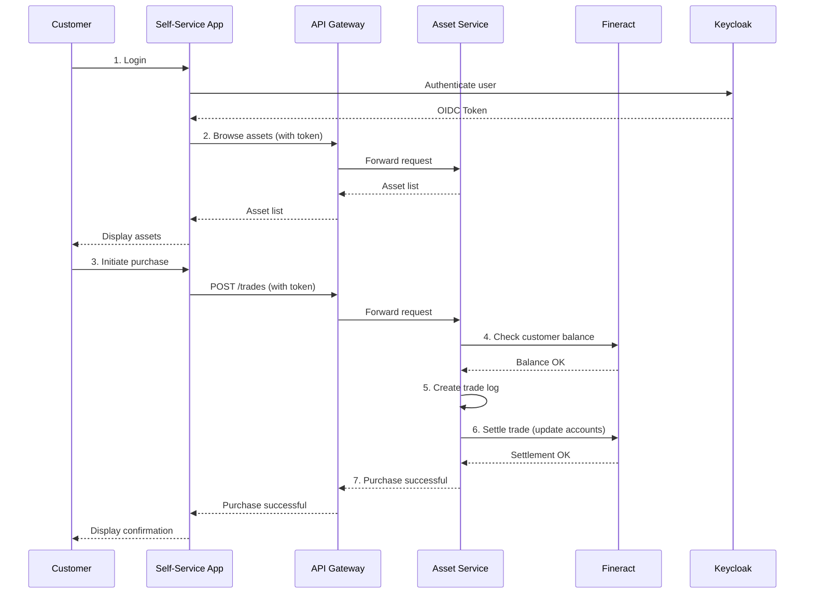

# Architecture Overview — fineract-apps

## System Overview
This project is a tokenized asset marketplace built on top of Apache Fineract. It follows a microservices architecture, with a set of backend services providing APIs for various business domains, and a suite of frontend applications for different user roles.

The system is designed to be a modern, cloud-native platform that is scalable, resilient, and secure. It leverages modern technologies like Spring Boot for the backend, React for the frontend, and Docker for containerization.

The main business domains it serves are:
- Asset tokenization and lifecycle management
- A marketplace for trading tokenized assets
- Customer self-service for account management and trading
- Admin interfaces for system management and operations

## Component Diagram
```mermaid
graph TD
    subgraph Users
        A[Customer]
        B[Admin]
    end

    subgraph Frontend Applications
        C[Self-Service App]
        D[Admin App]
        E[...]
    end

    subgraph Backend Services
        G[API Gateway]
        H[Asset Service]
        I[Payment Gateway Service]
        J[Customer Self-Service]
        K[User Sync Service]
    end

    subgraph Data Stores
        L[Asset DB\n(PostgreSQL)]
        M[Payment DB\n(PostgreSQL)]
        N[Customer DB\n(PostgreSQL)]
        O[Cache\n(Redis)]
        P[File Storage\n(MinIO)]
    end

    subgraph External Services
        Q[Keycloak\n(Authentication)]
        R[Fineract\n(Core Banking)]
    end

    A --> C
    B --> D

    C --> G
    D --> G
    E --> G

    G --> H
    G --> I
    G --> J

    H --> L
    H --> O
    H --> P
    H --> R

    I --> M
    I --> R

    J --> N
    J --> R

    K --> Q
    K --> R
```

## Key Components

**Backend Services:**
| Component | Responsibility | Tech Stack |
|---------------------------|-------------------------------------------------------------------------|-----------------|
| **Asset Service** | Manages the lifecycle of tokenized assets, including creation, pricing, and trading. | Java, Spring Boot |
| **Payment Gateway Service** | Integrates with payment providers to handle deposits and withdrawals. | Java, Spring Boot |
| **Customer Self-Service** | Handles customer registration, KYC, and account management. | Java, Spring Boot |
| **User Sync Service** | Synchronizes users between Keycloak and Fineract. | Python, Flask |

**Frontend Applications:**
| Component | Responsibility | Tech Stack |
|--------------------|--------------------------------------------------------------------------|--------------------|
| **Self-Service App** | Customer-facing application for managing accounts and trading assets. | React, TypeScript |
| **Admin App** | For administrators to manage users, assets, and system settings. | React, TypeScript |
| **Other Apps** | The project includes several other frontend apps for various roles (e.g., `account-manager`, `cashier`, `reporting`). | React, TypeScript |

## Data Flow
This section describes the data flow for a key use case: a customer purchasing an asset.



**Steps:**
1. The customer logs in to the Self-Service App, which authenticates them against Keycloak.
2. The frontend app fetches a list of available assets from the Asset Service.
3. The customer initiates a purchase order.
4. The Asset Service checks the customer's account balance in Fineract.
5. The Asset Service logs the trade in its own database.
6. The Asset Service orchestrates the settlement of the trade in Fineract, which involves debiting the customer's cash account and crediting their asset account.
7. The Asset Service confirms the purchase, and the frontend displays a confirmation to the customer.

## Key Design Decisions
This table highlights some of the key architectural decisions made for this project.

| Decision | Rationale |
|-------------------------------------|-----------------------------------------------------------------------------------------------------------------------------------------------------------------|
| **Microservices Architecture** | A microservices approach was chosen to enable independent development, deployment, and scaling of different business domains. This improves agility and resilience. |
| **Java/Spring Boot for Backend** | Spring Boot is a mature and robust framework for building enterprise-grade applications. It has excellent support for building microservices and a large ecosystem of libraries. |
| **TypeScript/React for Frontend** | React is a popular and powerful library for building modern user interfaces. TypeScript adds static typing, which improves code quality and maintainability. |
| **Containerization with Docker** | All applications are packaged as Docker containers. This ensures consistency across environments and simplifies the deployment process. |
| **GitOps for Deployment** | The project uses a GitOps workflow for deployments. This means that the state of the infrastructure is defined in a Git repository, and any changes are applied automatically. This improves traceability and auditability. |
| **External Identity Provider (Keycloak)** | Instead of building a custom authentication solution, the project integrates with Keycloak. This outsources the complexity of identity and access management to a dedicated and secure platform. |
| **Integration with Apache Fineract** | The system is built on top of Apache Fineract, leveraging its robust core banking functionalities. This allows the project to focus on its unique value proposition: the tokenized asset marketplace. |

## Infrastructure Overview
The project is designed to be deployed to a modern cloud environment.

- **Cloud Provider:** The application is cloud-agnostic but is intended to run on a major cloud provider like AWS, GCP, or Azure.
- **Container Orchestration:** The backend and frontend applications are containerized with Docker and are designed to be deployed to a Kubernetes cluster.
- **CI/CD:** The project has a CI/CD pipeline built with GitHub Actions. On every push to the `develop` and `main` branches, the pipeline automatically builds, tests, and pushes Docker images to GitHub Container Registry. The deployment is then handled by a GitOps workflow.
- **Monitoring and Alerting:** The system uses Prometheus for metrics collection and Grafana for visualization and alerting. The backend services are instrumented with Micrometer to expose metrics in the Prometheus format. Pre-built Grafana dashboards are available in the `observability/` directory.

## External Dependencies
The system relies on several external services and APIs:

| Service | Purpose | Fallback Strategy |
|-------------------|----------------------------------------------|-----------------------------------------------------------------|
| **Apache Fineract** | Provides the core banking functionalities. | The system is tightly coupled with Fineract. A circuit breaker is used to handle temporary outages. |
| **Keycloak** | Handles user authentication and authorization. | No fallback. If Keycloak is down, users cannot log in. |
| **Payment Providers** | The payment gateway service integrates with external payment providers (e.g., mobile money APIs) to handle deposits and withdrawals. | If a payment provider is down, the system should gracefully handle the failure and allow users to try again later. |
| **AWS S3 (or compatible)** | Used for storing asset-related files (e.g., images). The system can be configured to use MinIO for local development. | A fallback to a local file system is not implemented. |

## Security Architecture

**Authentication:**
The system uses OpenID Connect (OIDC) for authentication, with Keycloak as the identity provider. Users are redirected to Keycloak to log in, and upon successful authentication, the frontend applications receive an OIDC token and a refresh token.

**Authorization:**
The backend services are configured as OAuth 2.0 resource servers. They validate the JSON Web Tokens (JWTs) they receive from the frontend applications on every API request. The JWTs contain the user's roles and permissions, which are used to make authorization decisions.

**Secret Management:**
Secrets, such as API keys and database passwords, are externalized from the codebase. For local development, they are stored in `.env` files or passed as environment variables. In production, they should be managed by a dedicated secrets management solution (e.g., HashiCorp Vault, AWS Secrets Manager).

**Network Security:**
In a production environment, the application should be deployed in a Virtual Private Cloud (VPC). Network access between the services should be restricted using security groups or network policies. The API Gateway should be the only entry point to the backend services from the public internet.
