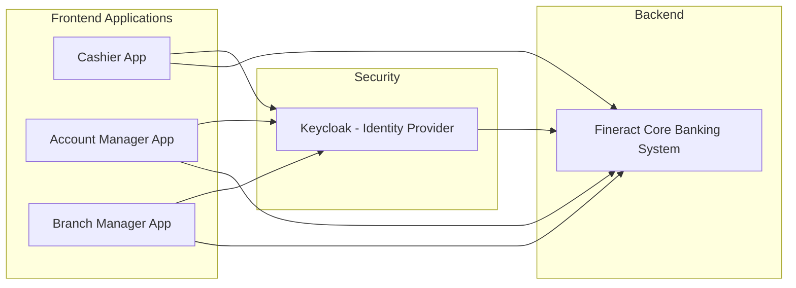
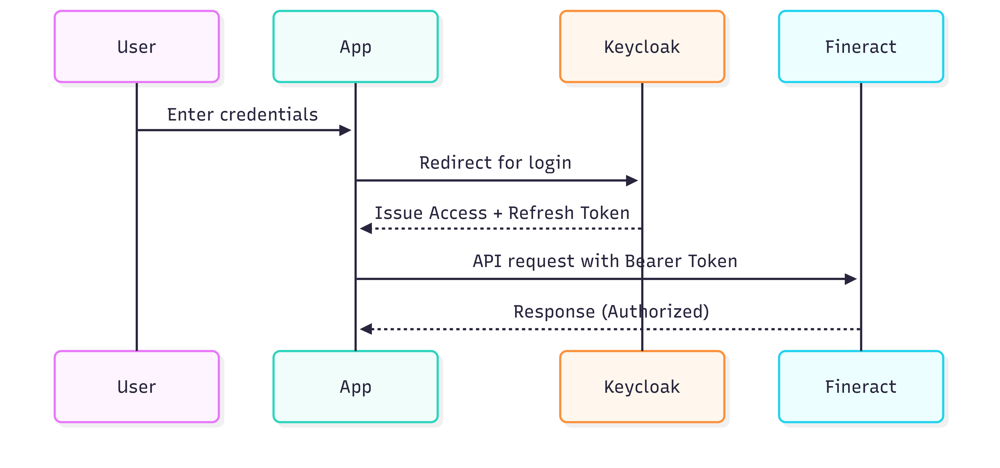
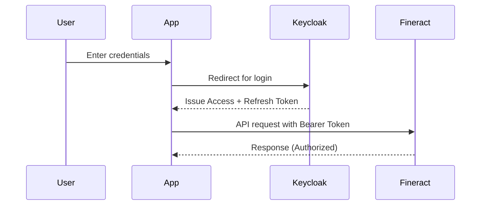
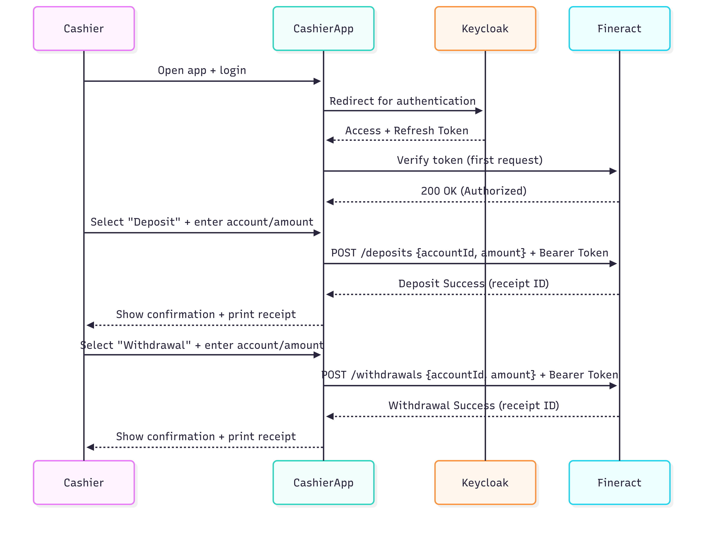
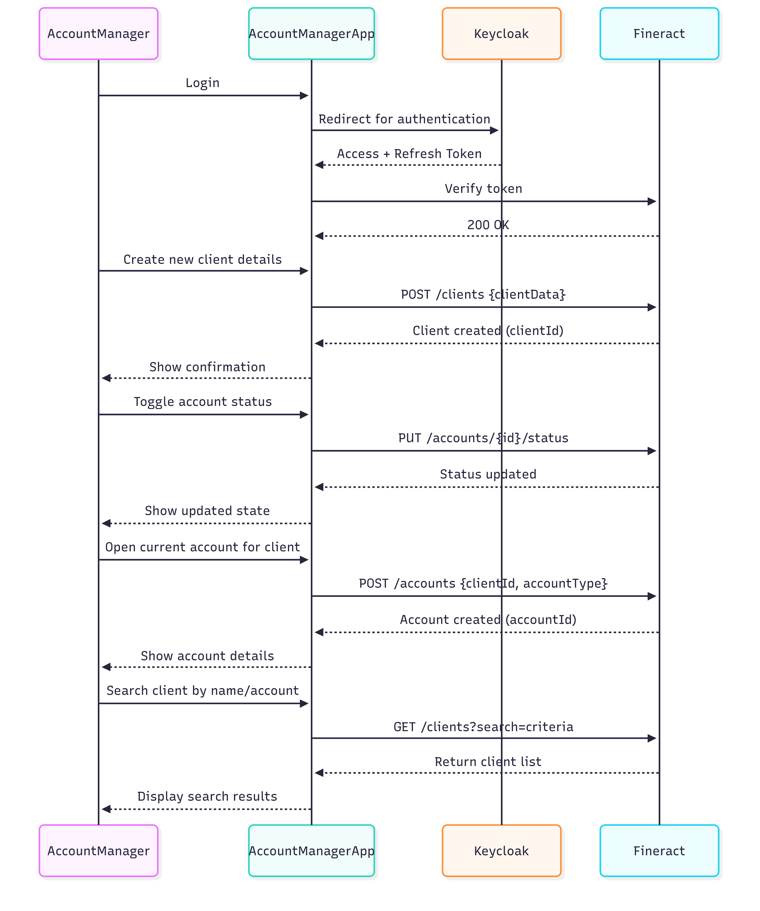
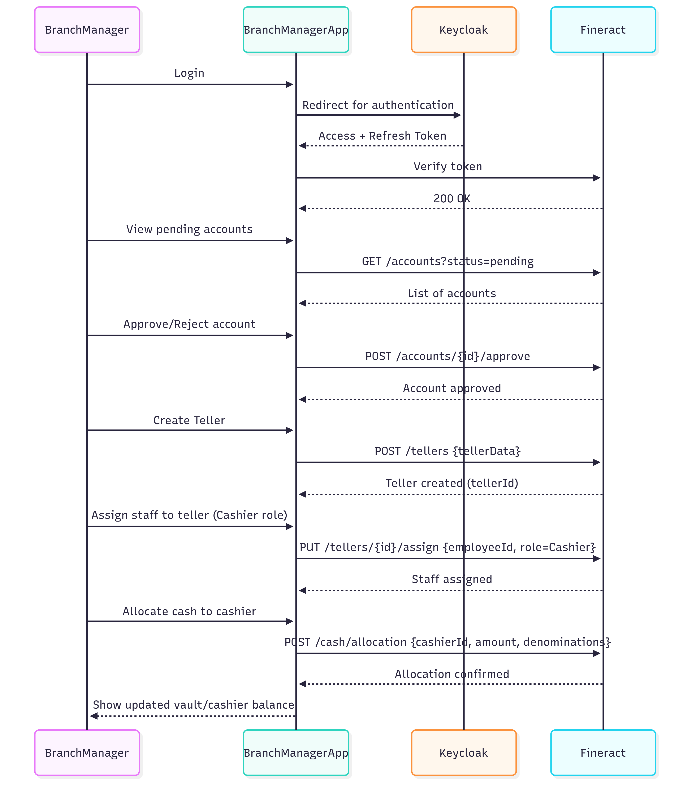
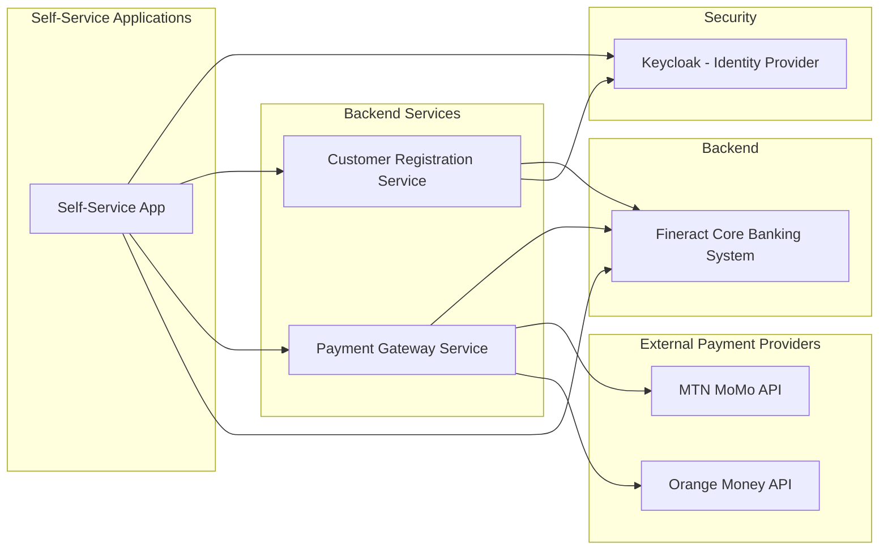
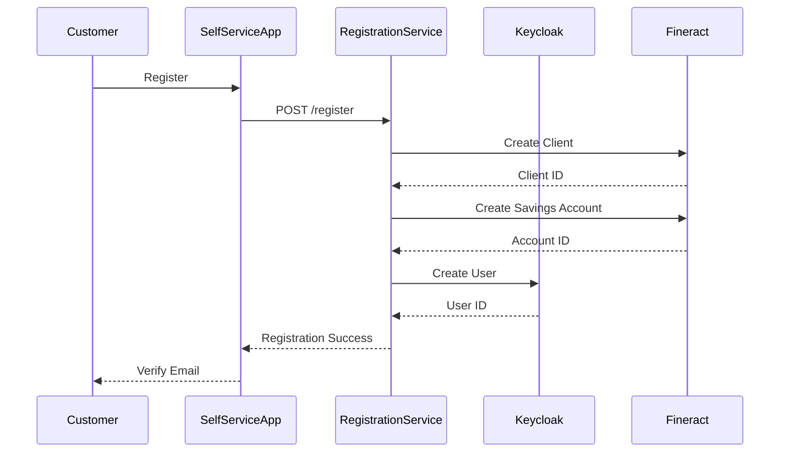
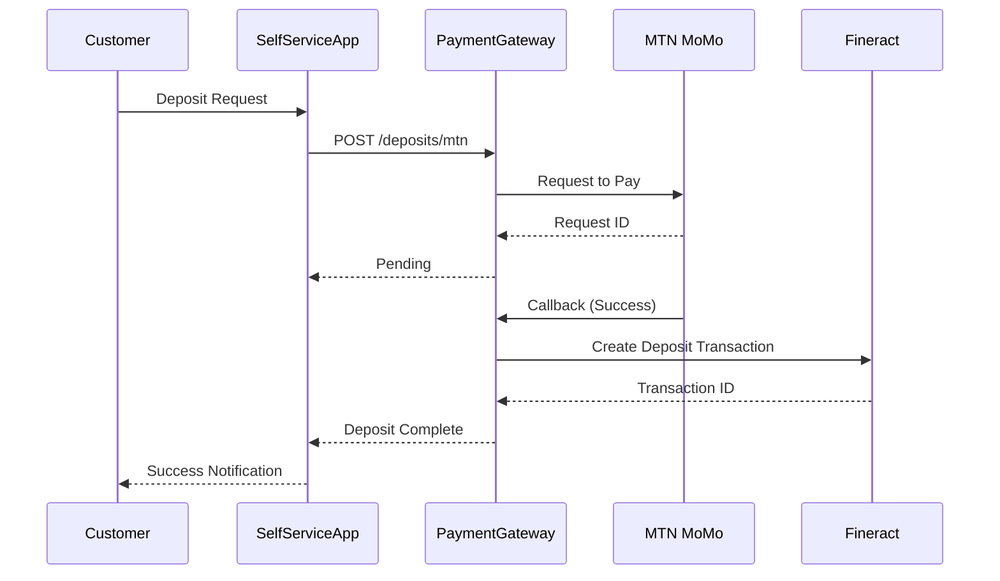
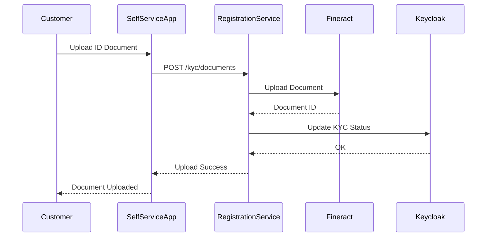

# Role Based Applications – End-to-End Flow Documentation
## 1. Overview

This document describes the end-to-end flow of a microfinance platform built on Apache Fineract with Keycloak authentication. The platform provides a secure and efficient way to manage microfinance operations through specialized applications for different roles.

### 1.1 Key Roles

The system supports three main roles, each with specific responsibilities:

| Role | Description | Key Functions |
|------|-------------|--------------|
| **Cashier** | Handles client cash transactions | Deposits, withdrawals, settlements |
| **Account Manager** | Manages clients and accounts | Onboarding, search, activation |
| **Branch Manager** | Supervises operations | Approvals, teller creation, cash allocations |
| **Self-Service Customer** | Mobile money customer (self-service) | Registration, deposits, withdrawals, KYC |

Each role has a dedicated application that interacts with the Fineract Core Banking System through Keycloak-secured access tokens.

## 2. System Architecture

### 2.1 Components

| Component | Description |
|-----------|-------------|
| **Frontend Applications** | Role-specific apps (Cashier, Account Manager, Branch Manager) |
| **Keycloak** | Identity and Access Management provider that handles authentication and authorization |
| **Fineract** | Core Banking System that processes all financial transactions and business logic |

### 2.2 Security Flow

- All applications authenticate against Keycloak
- After successful login, they receive OAuth2 access tokens
- These tokens are used to make secure API calls to Fineract
- Each role has restricted scopes (Cashier ≠ Branch Manager, etc.)

View Mermaid Diagram Code

## 3. Authentication Flow

<em>Authentication and Authorization Flow</em>

### 3.1 Authentication Process

The authentication process follows these steps:

1. User launches an app (Cashier, Account Manager, or Branch Manager)
2. The app redirects to Keycloak Login Page
3. User enters credentials
4. Keycloak verifies credentials and issues an Access Token + Refresh Token
5. The app stores the tokens securely (e.g., in memory or secure storage)

### 3.2 API Authorization

Once authenticated:

1. All API calls to Fineract include `Authorization: Bearer <token>` header
2. Keycloak validates the token when requested by Fineract
3. Fineract authorizes the request based on the user's role and permissions
4. The appropriate response is returned to the application

View Mermaid Diagram Code

## 4. Role-Based Flows

This section details the specific workflows for each role in the microfinance platform.

### 4.1 Cashier Flow

<em>Cashier Transaction Flow</em>

#### Key Responsibilities:

| Function | API Endpoint | Description |
|----------|--------------|-------------|
| **Authentication** | `/oauth/token` | Authenticate via Keycloak |
| **Deposits** | `POST /deposits` | Record cash deposits into client accounts |
| **Withdrawals** | `POST /withdrawals` | Process cash withdrawals from client accounts |
| **Settlement** | `POST /settlement` | Perform End-of-Day Settlement with the vault |

### 4.2 Account Manager Flow

<em>Account Manager Client Management Flow</em>

#### Key Responsibilities:

| Function | API Endpoint | Description |
|----------|--------------|-------------|
| **Authentication** | `/oauth/token` | Authenticate via Keycloak |
| **Client Creation** | `POST /clients` | Create new client profiles with personal information |
| **Client Search** | `GET /clients?search=query` | Find existing clients in the system |
| **Account Opening** | `POST /accounts` | Open new accounts for existing clients |
| **Account Status** | `PUT /accounts/{id}/status` | Activate or deactivate client accounts |

### 4.3 Branch Manager Flow

<em>Branch Manager Supervision Flow</em>

#### Key Responsibilities:

| Function | API Endpoint | Description |
|----------|--------------|-------------|
| **Authentication** | `/oauth/token` | Authenticate via Keycloak |
| **Account Approval** | `POST /accounts/{id}/approve` | Approve pending accounts created by Account Managers |
| **Teller Management** | `POST /tellers` | Create Tellers and assign staff as Cashiers |
| **Cash Allocation** | `POST /cash/allocation` | Allocate Cash to Cashiers for daily operations |
| **Vault Management** | `POST /vault/settlement` | Manage and reconcile Vault Settlements |

## 5. Self-Service Customer Flow

The Self-Service App provides mobile money customers with a direct interface for managing their accounts through mobile payments (MTN MoMo, Orange Money).

### 5.1 Components

View Mermaid Diagram Code

### 5.2 Key Responsibilities

| Function | Service/API | Description |
|----------|-------------|-------------|
| **Authentication** | Keycloak OIDC | Passwordless WebAuthn authentication |
| **Registration** | Customer Registration Service | Create Fineract client + Keycloak user |
| **View Account** | Fineract API (direct) | `GET /savingsaccounts/{id}` |
| **View Transactions** | Fineract API (direct) | `GET /savingsaccounts/{id}/transactions` |
| **KYC Upload** | Customer Registration Service | Upload ID documents for verification |
| **Deposits** | Payment Gateway Service | MTN MoMo or Orange Money collection |
| **Withdrawals** | Payment Gateway Service | MTN MoMo or Orange Money disbursement |

### 5.3 Registration Flow

View Mermaid Diagram Code

### 5.4 Mobile Money Deposit Flow

View Mermaid Diagram Code

### 5.5 KYC Document Upload Flow

View Mermaid Diagram Code

## 6. Conclusion

This documentation provides a comprehensive overview of the microfinance platform's architecture and workflows. The system is designed with clear separation of responsibilities across three main roles:

- **Cashiers** handle day-to-day cash transactions with clients
- **Account Managers** focus on client management and account creation
- **Branch Managers** provide oversight and approval functions

All interactions are secured through Keycloak authentication, ensuring that each role has appropriate access to the Fineract Core Banking System. This architecture provides a scalable, secure foundation for microfinance operations.
