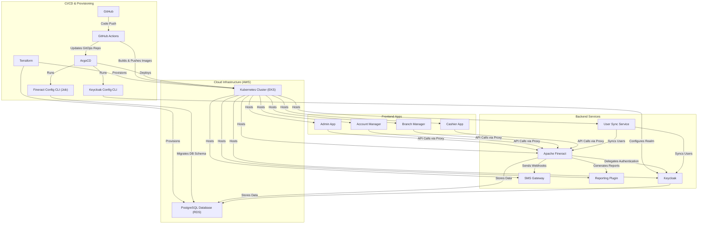
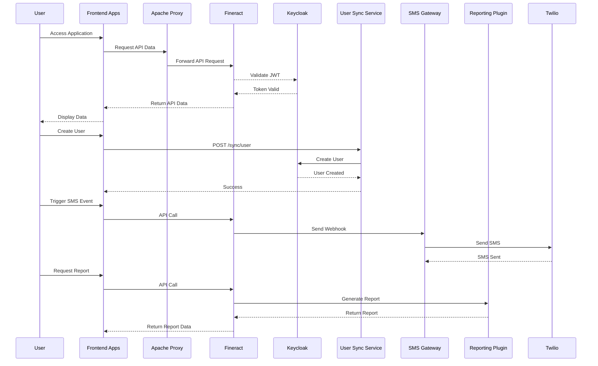
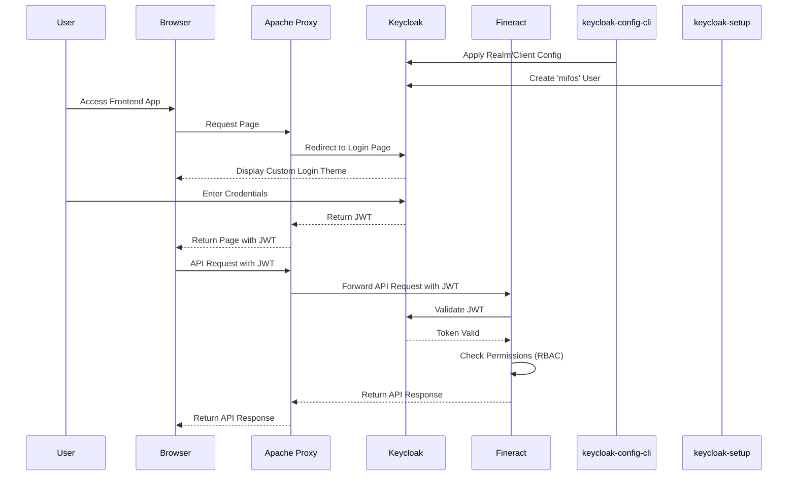
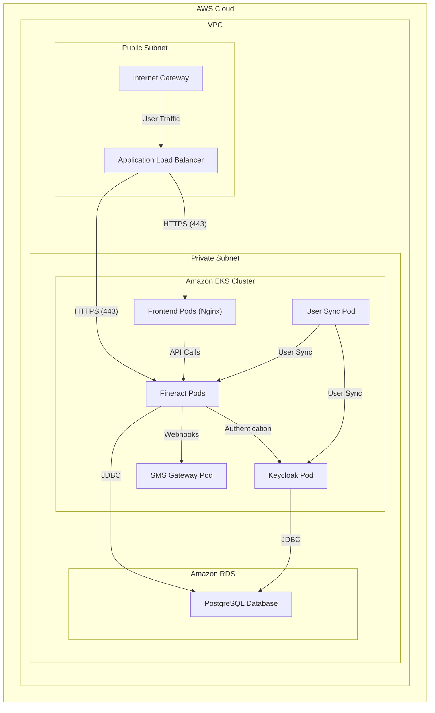
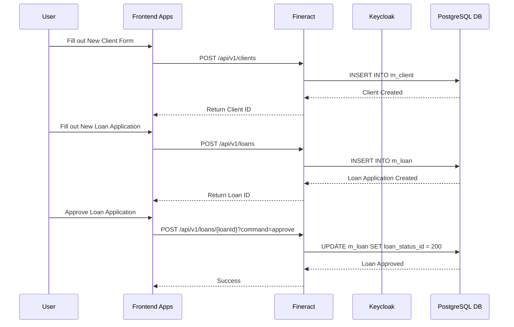

# Unified Platform Architecture

This document provides a comprehensive overview of the entire platform architecture, including front-end applications, backend services, integrations, infrastructure, and all custom extensions built on top of Apache Fineract.

## 1. Front-End Applications

The frontend is a modern, production-ready monorepo containing four single-page applications for the Apache Fineract platform.

- **Repository**: [https://github.com/ADORSYS-GIS/fineract-apps](https://github.com/ADORSYS-GIS/fineract-apps)

### 1.1. Applications

| App                 | Description                        | Role             |
| ------------------- | ---------------------------------- | ---------------- |
| **Admin App**       | User & staff management            | `admin`          |
| **Account Manager** | Accounting & financial operations  | `accountant`     |
| **Branch Manager**  | Client & office management         | `branch-manager` |
| **Cashier App**     | Teller operations & transactions   | `teller`         |

### 1.2. Tech Stack

- **React 19**: Latest React with concurrent features
- **TypeScript**: Full type safety
- **TanStack Router**: File-based routing with code splitting
- **TanStack Query**: Server state management
- **Formik + Zod**: Form handling with validation
- **TailwindCSS**: Utility-first styling
- **Vite**: Lightning-fast build tool
- **pnpm**: Efficient monorepo package manager
- **Biome**: Fast linting and formatting

### 1.3. Monorepo Structure

The `fineract-apps` repository is a monorepo managed with pnpm workspaces.

```
fineract-apps/
├── frontend/
│   ├── admin-app/
│   ├── account-manager-app/
│   ├── branchmanager-app/
│   └── cashier-app/
├── packages/
│   ├── ui/               # Shared UI components
│   └── fineract-api/     # Generated API client
├── .github/workflows/
└── Dockerfile.*
```

### 1.4. Authentication

Authentication is handled centrally by an Apache reverse proxy using `mod_auth_openidc` with Keycloak as the OIDC provider. The frontend applications themselves are "auth-dumb" and do not contain any authentication logic. The proxy injects the JWT access token into API requests to the Fineract backend.

### 1.5. Deployment

The applications are containerized using multi-stage Dockerfiles and served with Nginx. They are deployed to Kubernetes using a GitOps approach with ArgoCD, managed from the `fineract-gitops` repository. The CI/CD pipeline, managed with GitHub Actions, automatically builds and publishes Docker images to GitHub Container Registry (GHCR) on pushes to the `main` and `develop` branches.

## 2. Core CBS Platform: Apache Fineract

Apache Fineract serves as the core banking engine for the platform, providing a robust, scalable, and secure foundation for financial services.

- **Repository**: [https://github.com/ADORSYS-GIS/fineract](https://github.com/ADORSYS-GIS/fineract)

### 2.1. Overview

Fineract is an open-source platform for financial inclusion, offering a comprehensive suite of features for microfinance institutions and financial service providers. It is a modular, API-driven platform that allows for extensive customization and integration with other services.

### 2.2. Authentication and Authorization

Fineract delegates user authentication to **Keycloak**, an open-source identity and access management solution. The integration is achieved through OAuth 2.0 and OpenID Connect (OIDC).

- **Authentication Flow**: When a user attempts to access a protected resource, they are redirected to Keycloak for authentication. Upon successful login, Keycloak issues a JWT access token, which is then used to authenticate API requests to Fineract.
- **Authorization Model**: Fineract employs a robust Role-Based Access Control (RBAC) model for authorization. Once a user is authenticated, Fineract's internal RBAC model determines what actions the user is permitted to perform based on their assigned roles and permissions.

### 2.3. User Management

User management is synchronized between Fineract and Keycloak, with the **username** serving as the link between the two systems. For a user to be authenticated, a user with the same username must exist in both Fineract and the `fineract` realm in Keycloak.

### 2.4. Configuration

Fineract's configuration is managed through a combination of environment variables and configuration files. For Keycloak integration, the following properties are set in the `fineract-keycloak.env` file:

- `FINERACT_SECURITY_BASICAUTH_ENABLED=false`: Disables Fineract's built-in basic authentication.
- `FINERACT_SECURITY_OAUTH_ENABLED=true`: Enables OAuth 2.0 authentication.
- `FINERACT_SERVER_OAUTH_RESOURCE_URL`: Specifies the URL of the Keycloak authorization server for JWT token validation.

### 2.5. Interaction with Other Services

Fineract interacts with several other services in the platform:

- **Keycloak**: For authentication and authorization.
- **Apache Proxy**: Acts as a reverse proxy and secure gateway for the Fineract API.
- **User Sync Service**: Synchronizes users between Fineract and Keycloak.
- **Reporting Plugin**: Integrates with Fineract to provide reporting capabilities.

## 3. Custom Scripts & Tools

### 3.1. Mifos User Creation Script (`setup_keycloak.sh`)

- **Purpose**: This script is used to perform initial user setup in Keycloak after the server is running and the initial configuration has been applied. It creates a `mifos` user in the `fineract` realm with a default password and contact information.
- **Workflow**:
    1.  Logs into the Keycloak Admin CLI using admin credentials.
    2.  Creates a new user with a specified username, password, email, and first/last names.
    3.  Sets a permanent password for the new user.
- **Execution**: The script is executed inside the Keycloak container.
- **Repo Location**: `fineract/setup_keycloak.sh`

### 3.2. Adorsys Keycloak Config CLI

- **Purpose**: This tool is used to automatically configure Keycloak realms, roles, clients, and other settings from a set of configuration files. It is used to bootstrap the `fineract` realm with the necessary clients and roles for the Fineract platform.
- **Integration Points**: It runs as a Docker container that connects to the Keycloak service and applies configurations from the `/keycloak-config` directory.
- **Repo Location**: The configuration files are located in `fineract/keycloak-config`. The tool itself is a public Docker image: `adorsys/keycloak-config-cli`.

### 3.3. Adorsys Keycloak Theme

- **Purpose**: This is a custom theme for Keycloak that provides a branded login and account management experience for the platform. It ensures that the user interface for authentication is consistent with the look and feel of the rest of the applications.
- **Deployment**: The theme is packaged as a JAR file (`theme-1.0.1.jar`) and is deployed to Keycloak by mounting it as a volume in the Keycloak container. The theme is then enabled by setting the `KC_THEME_DEFAULT` environment variable in the `docker-compose.yml` file.
- **Repo Location**: `fineract/keycloak-theme`

### 3.4. Fineract Config CLI

- **Purpose**: The Fineract Config CLI is a standalone Spring Boot command-line application that provides a declarative way to manage the configuration of a Fineract instance. It follows the "Configuration-as-Code" pattern, allowing you to define the entire Fineract configuration in a set of YAML files and apply it to a Fineract instance in an idempotent and automated way.
- **Key Features**:
    - **Declarative Configuration**: Define all Fineract entities, from offices and roles to loan products and chart of accounts, in YAML files.
    - **Idempotent Operations**: The CLI can be run multiple times without causing errors or creating duplicate entities. It intelligently creates or updates entities based on the configuration.
    - **Change Detection**: The CLI uses checksums to detect changes in the configuration and only applies the changes that are needed.
    - **Dry Run Mode**: A `--dry-run` option allows you to preview the changes that will be made without actually applying them.
- **Commands**:
    - `import`: Imports a configuration from a YAML file.
    - `export`: Exports the Fineract configuration to a YAML file.
    - `validate`: Validates the syntax and semantics of a configuration file.
- **Repo Location**: `fineract/docs/data-collection/fineract-config-cli`

### 3.5. Fineract Demo Data Generator (Init App)

- **Purpose**: This tool is a production-ready system for generating and loading OHADA-compliant demo data into Apache Fineract. It populates a Fineract instance with a comprehensive set of demo data, including offices, staff, clients, products, and accounts.
- **Workflow**:
    1.  **Excel Generation**: A Python script (`generate_excel_template.py`) creates an Excel file with pre-configured demo data.
    2.  **API Loading**: Another Python script (`load_demo_data.py`) reads the Excel file and loads the data into Fineract using REST APIs.
- **Execution**: The process is automated by the `quickstart.sh` script, which first generates the Excel template and then loads the data into Fineract.
- **Configuration**: The Fineract API connection settings are configured in the `fineract_config.json` file.
- **Repo Location**: `fineract/docs/data-collection/fineract-demo-data`

## 4. Reporting Plugin

The platform uses the **Mifos Reporting Plugin** to integrate the **Pentaho Business Intelligence (BI) suite** with Apache Fineract, enabling powerful and flexible data reporting and analytics.

- **Architecture and Purpose**: The plugin acts as a bridge between Fineract and the Pentaho reporting engine. It uses pre-designed Pentaho report templates (`.prpt` files) that define the data queries, parameters, and layout for each report. When a report is requested via the Fineract API, the plugin invokes the Pentaho engine, which executes the report's SQL queries against the Fineract database and generates the final document in the requested format (e.g., PDF, Excel, CSV).

- **Integration with Fineract**: The Mifos Reporting Plugin is deployed as a standard Fineract module. It is loaded into the Fineract application at runtime and integrates with the core system to expose Pentaho's reporting capabilities through the Fineract API. This allows any client application with API access to generate data-rich reports.

- **Deployment Model and Dependencies**:
    - **Deployment**: The plugin is deployed by placing the plugin files in a designated directory that is loaded by Fineract at startup. For containerized deployments, this is typically handled by mounting a volume or building a custom Docker image that includes the plugin.
    - **Dependencies**: The primary dependency is the **Pentaho reporting engine**, which is included as part of the plugin. The report templates (`.prpt` files) are also a key dependency and are managed separately to allow for updates without redeploying the entire application.

For detailed instructions on installation, configuration, and usage, please refer to the [Mifos Reporting Plugin Guide](fineract/doc/Mifos_Repoerting_Plugin_Guide.md).

## 5. SMS Gateway

The SMS Gateway is a Spring Boot application that acts as a gateway between Fineract and an SMS provider (Twilio). It listens for webhook notifications from Fineract and sends SMS messages to clients based on the events.

- **Repository**: `fineract/sms-gateway`

### 5.1. Purpose

- **Decoupling**: It decouples the Fineract core from the SMS provider, allowing for a more modular and maintainable architecture.
- **Automation**: It automates the process of sending SMS messages to clients, reducing manual effort and potential for errors.

### 5.2. Workflow

1.  **Fineract Webhook**: Fineract is configured to send a webhook notification to the `/sms/` endpoint of this application when a transaction occurs.
2.  **SmsController**: The `SmsController` receives the webhook payload.
3.  **MessageService**: The `SmsController` passes the payload to the `MessageService`.
4.  **FineractService**: The `MessageService` uses the `FineractService` to fetch the SMS template and the client's phone number from the Fineract API.
5.  **SmsService**: The `MessageService` uses the `SmsService` to send the SMS message to the client using the Twilio API.

### 5.3. Configuration

The application is configured using environment variables to securely manage credentials for Twilio and Fineract.

## 6. User Sync Service

The User Sync Service is a Python-based microservice that synchronizes user data between the Fineract platform and Keycloak.

- **Repository**: `fineract-apps/user-sync-service`

### 6.1. Purpose

- **Decoupling**: It decouples the Fineract core from Keycloak, allowing for a more modular architecture.
- **Security**: It centralizes user identity management in Keycloak, leveraging its security features.
- **Automation**: It automates the process of creating and managing users in Keycloak.

### 6.2. Integration

The `frontend/admin-app` interacts with this service via a set of RESTful APIs. The Vite development server in the admin app is configured to proxy requests from `/api/user-sync` to this service.

### 6.3. API Endpoints

- `GET /health`: Checks the health of the service and its connection to Keycloak.
- `POST /sync/user`: Creates a new user in Keycloak.
- `POST /users/{username}/reset-password`: Triggers a password reset email to be sent to the user.
- `PUT /users/{username}/status`: Enables or disables a user in Keycloak.
- `POST /users/{username}/force-password-change`: Forces a user to change their password on their next login.
- `GET /users/{username}/keycloak-status`: Retrieves a user's status and details from Keycloak.

### 6.4. Configuration

The service is configured using environment variables, as defined in the `.env` file. For production, it uses the `gunicorn` WSGI server.

## 7. Extensions Modules

The platform includes custom extension modules that enhance and override Fineract's native behavior. These modules are located in the `fineract/custom/adorsys` directory and are enabled via properties in the Fineract configuration.

### 7.1. Teller Module

- **Purpose**: This module provides a custom implementation of the `TellerManagementReadPlatformService` to customize how cashier data is retrieved and presented.
- **How it Extends Fineract**: It overrides the default `getCashierData` method to provide a custom implementation.
- **Activation**: This module is enabled by setting the `adorsys.teller.extended.enabled` property to `true` in the Fineract configuration.
- **Repository Location**: `fineract/custom/adorsys/teller`

### 7.2. User and Staff Module

- **Purpose**: This module provides a unified API for managing employees, combining Fineract's `AppUser` and `Staff` entities into a single `Employee` concept. This simplifies user management by providing a single set of endpoints for creating, updating, and retrieving employee data.
- **How it Extends Fineract**: It introduces a new API endpoint (`/api/v1/adorsys/employees`) and a custom data transfer object (`EmployeeData`) that combines user and staff information.
- **Activation**: This module is enabled by setting the `adorsys.userandstaff.extended.enabled` property to `true` in the Fineract configuration.
- **Repository Location**: `fineract/custom/adorsys/userandstaff`

## 8. Fineract Source Code Modifications

The platform's customizations to Apache Fineract are implemented as self-contained, modular extensions rather than direct modifications to the core source code. This approach minimizes the impact on future upgrades and makes the customizations easier to maintain.

- **Location in the Codebase**: All custom modules are located in the `fineract/custom/adorsys` directory.
- **Custom Modules**:
    - **`teller`**: Overrides the default cashier data service to provide enhanced filtering capabilities.
    - **`userandstaff`**: Introduces a unified "Employee" concept and simplifies user management.
- **Reason for Modification**: The primary reason for these modifications is to extend Fineract's functionality to meet specific business requirements that are not supported by the core platform. By using a modular approach, these extensions can be enabled or disabled as needed without affecting the core Fineract application.
- **Impact on Upgrades**: The impact of these customizations on Fineract upgrades is expected to be minimal, as they are implemented as separate modules that do not modify the core Fineract codebase. However, it is important to test the custom modules thoroughly after any Fineract upgrade to ensure that they continue to function as expected.

## 9. Deployment Strategy

The platform is deployed using a modern GitOps approach, with a strong emphasis on automation, containerization, and infrastructure as code.

- **Full CI/CD Flow**: The CI/CD pipeline is managed using **GitHub Actions**. When code is pushed to the `main` or `develop` branches, GitHub Actions automatically builds the Docker images, runs tests, and pushes the images to a container registry. **ArgoCD** then detects the new images and automatically deploys them to the appropriate environment, ensuring that the deployed applications are always in sync with the desired state defined in the `fineract-gitops` repository.

- **Environment Structure**: The platform is deployed to multiple environments, including `dev`, `uat`, and `production`. Each environment is defined by a set of **Kustomize** overlays that customize the Kubernetes manifests for that environment. This allows for a consistent and repeatable deployment process across all environments.

- **Containerization Strategy**: All applications are containerized using **Docker**. The Dockerfiles are optimized for production, using multi-stage builds to create small and secure images. The containerized applications are deployed to an **Amazon EKS (Elastic Kubernetes Service)** cluster.

- **Infrastructure Dependencies**: The underlying infrastructure is managed using **Terraform**. This includes the EKS cluster, **Amazon RDS** for the Fineract and Keycloak databases, and other AWS resources. This infrastructure-as-code approach ensures that the infrastructure is provisioned in a consistent and repeatable manner.

- **Observability**: The platform has a comprehensive observability stack that includes:
    - **Prometheus**: For monitoring and alerting.
    - **Grafana**: For visualizing metrics.
    - **Loki**: For log aggregation.
    - **Promtail**: For collecting logs from the Kubernetes cluster.

## 10. Repositories Overview

The platform is composed of several repositories, each with a specific purpose.

| Repository | Description | Branching Strategy |
| --- | --- | --- |
| **fineract-apps** | A monorepo containing the four single-page applications that make up the frontend of the platform. | TBD |
| **fineract** | A fork of the Apache Fineract project, which serves as the core banking platform. This repository also contains the custom `adorsys` extension modules. | TBD |
| **fineract-gitops** | The GitOps repository that contains the Kubernetes manifests and ArgoCD application definitions for deploying the platform. | TBD |

### Upstream Dependencies

| Repository | Description |
| --- | --- |
| **[https://github.com/apache/fineract](https://github.com/apache/fineract)** | The upstream Apache Fineract project, from which the `fineract` repository is forked. |
| **[https://github.com/ADORSYS-GIS/fineract-apps](https://github.com/ADORSYS-GIS/fineract-apps)** | The upstream repository for the frontend applications. |

## 11. Architecture Diagrams

### 11.1. High-Level System Architecture



### 11.2. Component Interaction Diagram



### 11.3. Authentication & Authorization Flow



### 11.4. Deployment & Network Topology



### 11.5. Data Flow for Key Business Operations (Example: New Loan Application)

